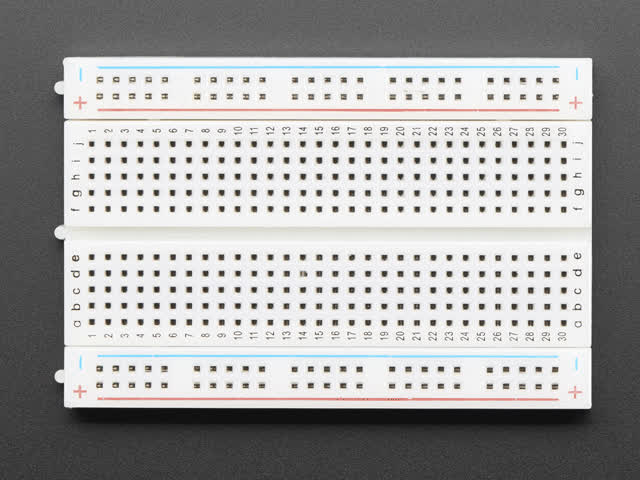
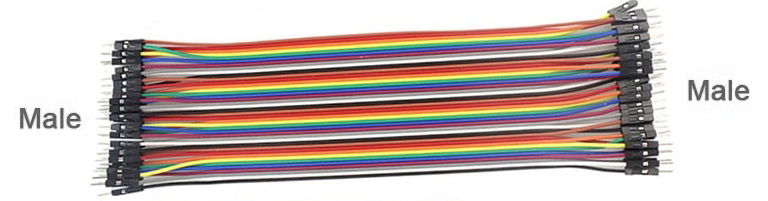

==========================
Breadboard connections
==========================

A breadboard lets you build electrical circuits.

You can connect:

* LEDs
* resistors
* buzzers
* motors

The micro:bit controls these parts.

----

Rows
--------------------------

Rows are numbered.

* Holes in the same numbered row are connected.
* Electricity can move between these holes.
* The two sides of the breadboard are **not** connected.

Look at the middle gap.
The gap stops the connection.

----

Columns
--------------------------

Columns are lettered.

* Holes in the same lettered column are **not** connected.

----

Rails
--------------------------

Rails run along the outside edges.

* The red (+) rail is connected all the way along.
* The blue (-) rail is connected all the way along.

These rails are often used for power.

----

Jumpers
--------------------------

Jumper wires join parts together.

Use **male-to-male** jumper wires to connect holes on the breadboard.

There are three common types of jumper wires.

.. image:: images/jumper_wire_types.jpg
    :scale: 50 %
