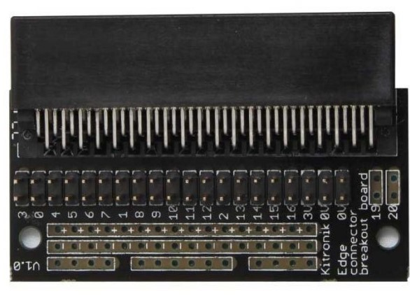
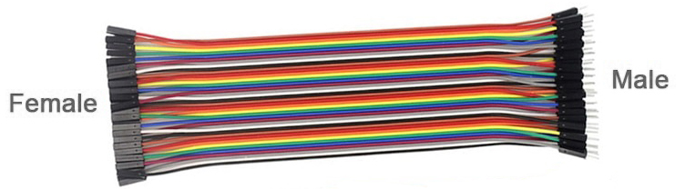

==========================
Edge Connector
==========================

Connecting the micro:bit
--------------------------

The edge connector lets the micro:bit plug into the breadboard.

The main pins are:

* pin0
* pin1
* pin2
* 0V (ground)

----

Use **female-to-male** jumper wires.

The female end pushes onto the edge connector.

The male end plugs into the breadboard.

----

The micro:bit faces upwards.

.. image:: images/main_pins.jpg
    :scale: 50 %

Most circuits use:

* pin0
* pin1
* pin2
* 0V

The electricity leaves through pin0, pin1 or pin2.

It returns through **0V (ground).**
