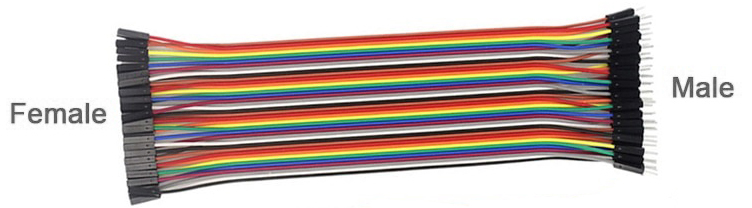

==========================
Edge Connector
==========================

Connecting the microbit
--------------------------

The edge connector lets the microbit plug into the breadboard.

.. image:: images/edge_connector.jpg
    :scale: 100 %

The main pins are:

* pin0
* pin1
* pin2
* 0V (ground)

----

Use **female-to-male** jumper wires.

The female end pushes onto the edge connector.

The male end plugs into the breadboard.

----

The microbit faces upwards.

.. image:: images/main_pins.jpg
    :scale: 50 %

