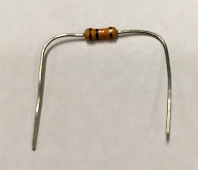
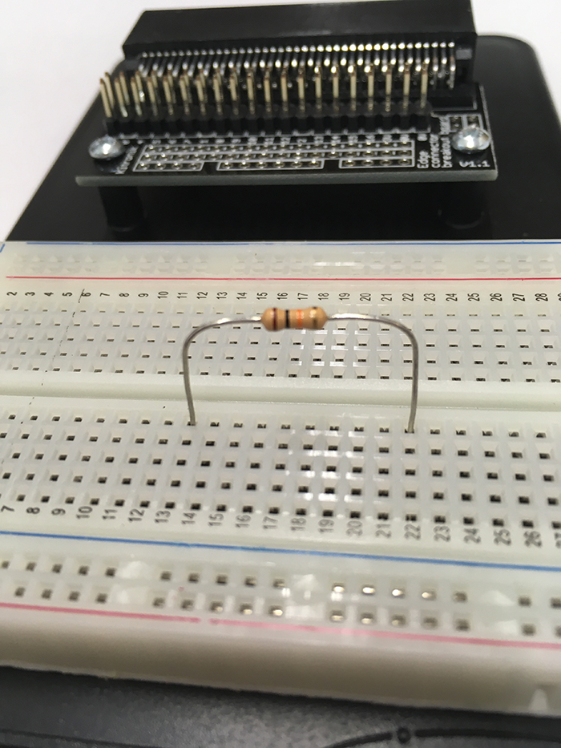
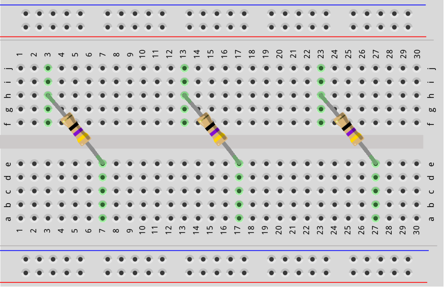
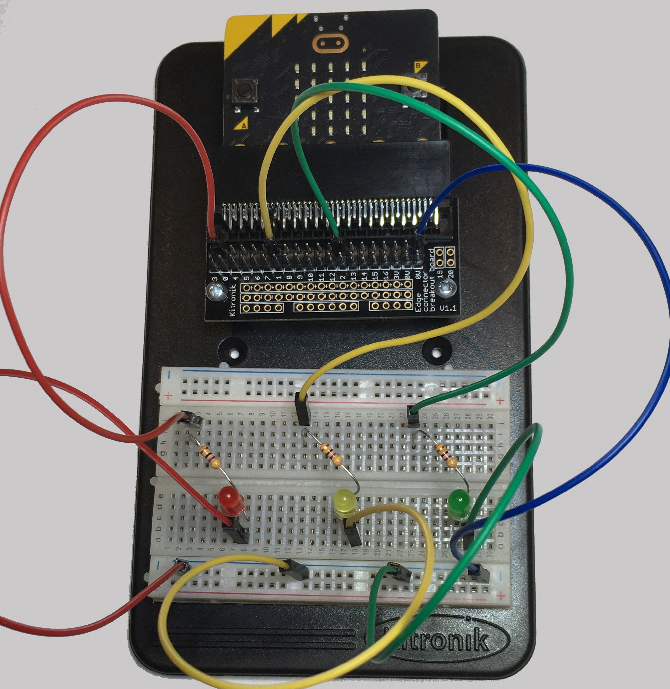

==========================
LEDs_digital
==========================

| In this lesson you will connect **three LEDs** to a micro:bit.
| You will learn how to make LEDs turn **ON** and **OFF** using code.

----

What you need
--------------------------

You need:

* A micro:bit
* A breadboard
* Three LEDs
* Three 47 ohm resistors
* Jumper wires

Each LED needs a **47 ohm resistor**.

.. image:: images/47ohm.png
    :scale: 50 %

The resistor stops too much electricity going into the LED.

Without the resistor, the LED could be damaged.

The 47 ohm resistor has these colour bands:

* Yellow
* Violet
* Black
* Gold

The LEDs connect to these micro:bit pins:

* Red LED → pin0
* Yellow LED → pin1
* Green LED → pin2

Every LED must also connect to **0V (Ground)**.

----

Making the resistor ready
--------------------------

Bend each resistor into a **U shape**.

Hold the resistor near the middle when bending.

This stops the legs from breaking.

Push the resistor legs into the breadboard.

Push them in about **5 mm**.

The resistor should sit above the breadboard.

----

Building the circuit
--------------------------

Follow these steps:

#. Put the three resistors into the breadboard first.
#. Add the three LEDs.
#. Look for the **long leg** of each LED.
#. The long leg goes towards the micro:bit pins.
#. In this model, the long leg is on the **left side**.
#. Add the jumper wires.

Check your LEDs:

* Red LED → pin0
* Yellow LED → pin1
* Green LED → pin2

.. image:: images/3LEDS_2_bb.png
    :scale: 50 %

.. image:: images/3LEDS_3_bb.png
    :scale: 50 %

----

Turning an LED ON and OFF
----------------------------------------

The command:

``write_digital()``

lets the micro:bit control an LED.

The command has two choices:

``1`` means:

**Turn the LED ON**

``0`` means:

**Turn the LED OFF**

For example:

Turn on the LED connected to pin0:

``pin0.write_digital(1)``

Turn off the LED connected to pin0:

``pin0.write_digital(0)``

To control another LED, change:

* ``pin0`` to ``pin1``
* ``pin0`` to ``pin2``

----

Control one LED
----------------------------------------

Try this:

* Press **Button A** → Red LED turns **ON**
* Press **Button B** → Red LED turns **OFF**

.. code-block:: python

    from microbit import *

    while True:
        if button_a.is_pressed():
            pin0.write_digital(1)

        elif button_b.is_pressed():
            pin0.write_digital(0)

        sleep(500)

Think about it:

What does:

``1`` do?

What does:

``0`` do?

----

Control all three LEDs
----------------------------------------

Try this:

* Press **Button A** → All LEDs turn ON.
* Press **Button B** → All LEDs turn OFF.

.. code-block:: python

    from microbit import *

    while True:
        if button_a.is_pressed():
            pin0.write_digital(1)
            pin1.write_digital(1)
            pin2.write_digital(1)

        elif button_b.is_pressed():
            pin0.write_digital(0)
            pin1.write_digital(0)
            pin2.write_digital(0)

        sleep(500)

----

Try These Challenges
----------------------------------------

Remember:

* Red LED → pin0
* Yellow LED → pin1
* Green LED → pin2

**Challenge 1**

Press **A**:

* Turn on the **red LED only**.

Press **B**:

* Turn on the **yellow and green LEDs only**.

**Challenge 2**

Press **A**:

* Turn on the **green LED only**.

Press **B**:

* Turn on the **red and yellow LEDs only**.

.. dropdown:: Challenge Solutions
        :icon: codescan
        :color: primary
        :class-container: sd-dropdown-container

        .. tab-set::

            .. tab-item:: Challenge 1 Solution

                .. code-block:: python

                    from microbit import *

                    while True:
                        if button_a.is_pressed():
                            pin0.write_digital(1)
                            pin1.write_digital(0)
                            pin2.write_digital(0)

                        elif button_b.is_pressed():
                            pin0.write_digital(0)
                            pin1.write_digital(1)
                            pin2.write_digital(1)

                        sleep(500)

            .. tab-item:: Challenge 2 Solution

                .. code-block:: python

                    from microbit import *

                    while True:
                        if button_a.is_pressed():
                            pin0.write_digital(0)
                            pin1.write_digital(0)
                            pin2.write_digital(1)

                        elif button_b.is_pressed():
                            pin0.write_digital(1)
                            pin1.write_digital(1)
                            pin2.write_digital(0)

                        sleep(500)

----

Blinking LEDs
----------------------------------------

Blinking means:

**ON → OFF → ON → OFF**

Try this:

* Button A → LEDs blink one at a time.
* Button B → All LEDs blink together.

Watch carefully.

Which one looks different?

.. code-block:: python

    from microbit import *

    while True:

        if button_a.is_pressed():

            pin0.write_digital(1)
            sleep(500)
            pin0.write_digital(0)

            pin1.write_digital(1)
            sleep(500)
            pin1.write_digital(0)

            pin2.write_digital(1)
            sleep(500)
            pin2.write_digital(0)

        elif button_b.is_pressed():

            pin0.write_digital(1)
            pin1.write_digital(1)
            pin2.write_digital(1)

            sleep(750)

            pin0.write_digital(0)
            pin1.write_digital(0)
            pin2.write_digital(0)

            sleep(750)

----

Using a for-loop
----------------------------------------

A **for-loop** repeats instructions.

Instead of writing the same code many times, we can tell Python:

"Repeat this."

This program makes the red LED blink **3 times**.

.. code-block:: python

    from microbit import *

    while True:
        for i in range(3):
            pin0.write_digital(1)
            sleep(1000)

            pin0.write_digital(0)
            sleep(1000)

        sleep(3000)

.. tip::

   Try changing:

   ``range(3)``

   What happens with:

   * ``range(2)``
   * ``range(5)``
   * ``range(10)``

How many times does the LED blink?

----

Lesson Review
----------------------------------------

Before moving to the next lesson, check that you can do these things.

.. admonition:: ✔ Lesson Checklist

    Can you:

    ☐ Build a circuit with three LEDs and three resistors.

    ☐ Identify a 47 ohm resistor by its colour bands.

    ☐ Connect the LEDs to:

       * Red LED → pin0
       * Yellow LED → pin1
       * Green LED → pin2

    ☐ Explain why every LED needs a resistor.

    ☐ Explain what the long leg of an LED is used for.

    ☐ Use ``write_digital(1)`` to turn an LED ON.

    ☐ Use ``write_digital(0)`` to turn an LED OFF.

    ☐ Control LEDs using the A and B buttons.

    ☐ Change ``range(3)`` to make an LED blink more or fewer times.

