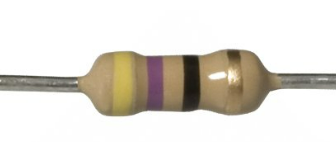
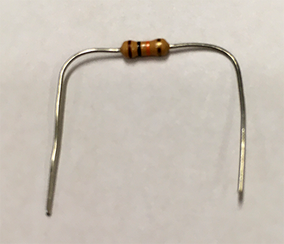
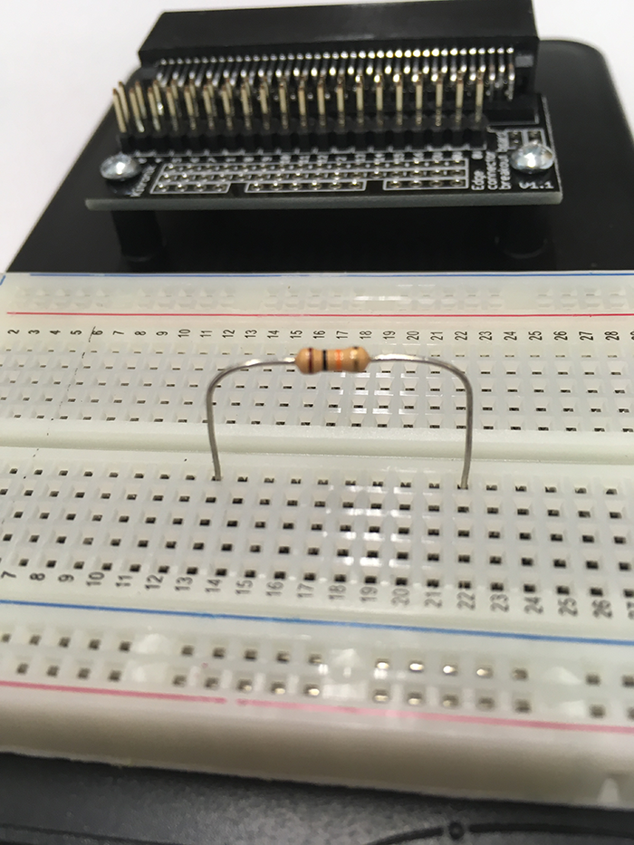
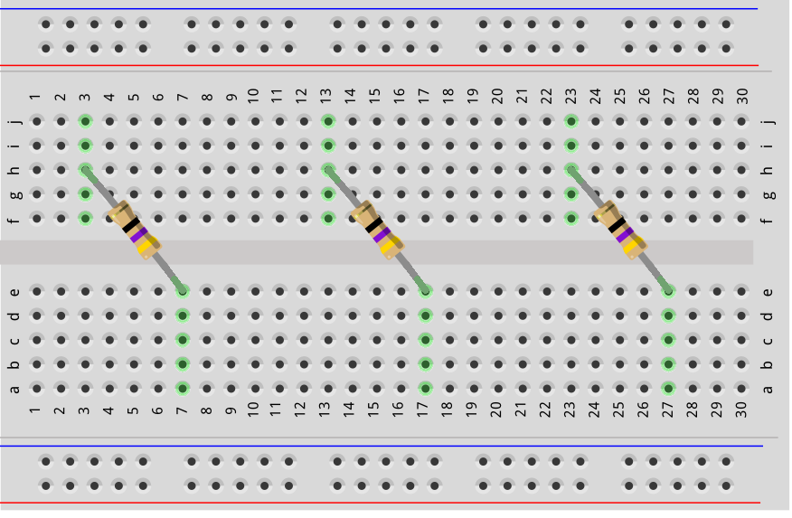
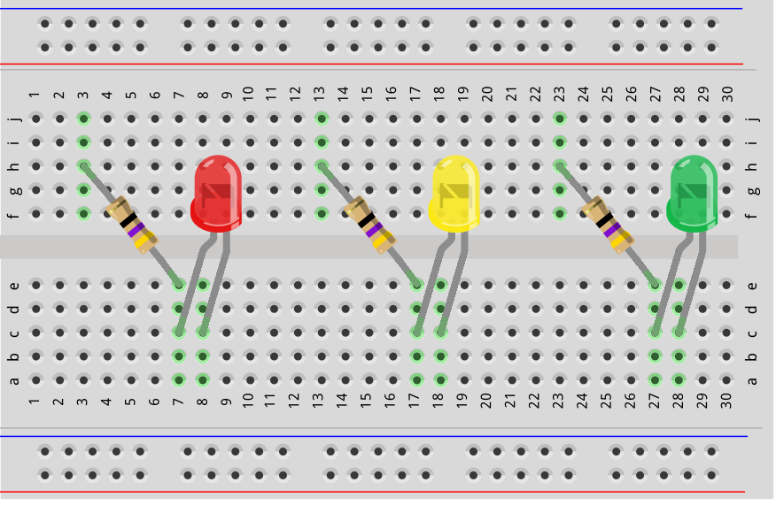
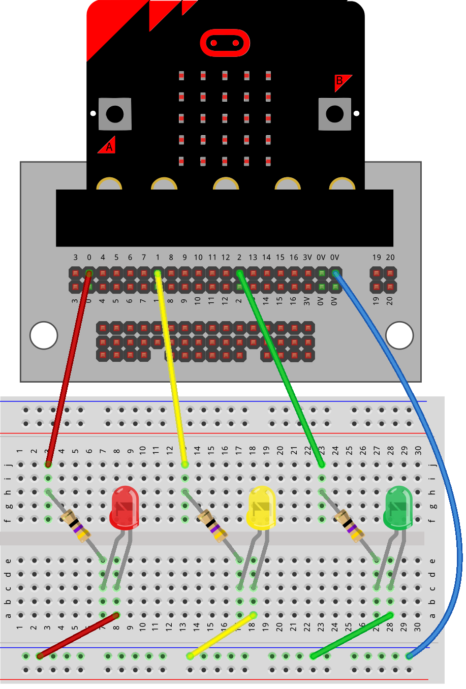
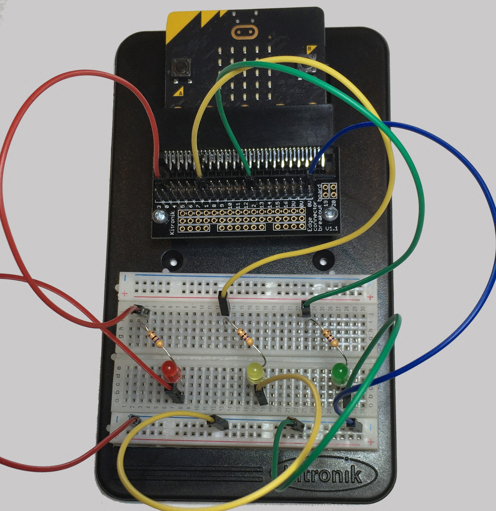

==========================
LEDs digital
==========================

| In this lesson you will connect **three LEDs** to a micro:bit.
| You will learn how to make LEDs turn **ON** and **OFF** using code.

----

What you need
--------------------------

You need:

* A micro:bit
* A breadboard
* Three LEDs (red, yellow, green)
* Three 47 ohm resistors (bands of: yellow, violet, black, gold)
* Jumper wires

Each LED needs a **47 ohm resistor**.

| The resistor stops too much electricity going into the LED.
| Without the resistor, the LED could be damaged.

----

Making the resistor ready
--------------------------

| Bend each resistor into a **U shape**.
| Hold the resistor near the middle when bending.
| This stops the legs from breaking.

| Push the resistor legs into the breadboard.
| Push them in about **5 mm**.
| The resistor should sit above the breadboard.

----

Building the circuit
--------------------------

Follow these steps:

#. Put the three resistors into the breadboard first.
#. Add the three LEDs.
#. Look for the **long leg** of each LED.
#. The long leg goes towards the micro:bit pins.
#. In this model, the long leg is on the **left side**.
#. Add the jumper wires.

Check your LEDs:

* Red LED → pin0
* Yellow LED → pin1
* Green LED → pin2

----

Turning an LED ON and OFF
----------------------------------------

| Use the ``write_digital(1)`` command to turn an LED ON.
| Use the ``write_digital(0)`` command to turn an LED OFF.

| For example:
| Turn on the LED connected to pin0:
| ``pin0.write_digital(1)``

| Turn off the LED connected to pin0:
| ``pin0.write_digital(0)``

| Can you work out how to turn on an LED on one of the other pins?

.. cloze::

    Turn on the LED connected to pin1:
    @@pin1 | pin2@@.write_digital(1)
    Turn on the LED connected to pin2:
    @@pin2 | pin1@@.write_digital(1)

----

Turn on and off one LED
----------------------------------------

| The code below turns the LED connected to pin0 **ON** for 1 second, and then **OFF** for 1 second, then repeats.

.. cloze::
    :show-code:

    from microbit import *

    while True:
        pin0.write_digital(@@ 1 | 0 @@)
        sleep(1000)
        pin0.write_digital(@@ 0 | 1 @@)
        sleep(1000)

----

Control one LED with button A
----------------------------------------

Fix the indenting in the code below to do this:

* Press **Button A** → Red LED turns **ON**
* No press → Red LED turns **OFF**

.. ordering::
    :no-padding:
    :no-reorder:
    :show-code:

    from microbit import *

    while True:
        if button_a.is_pressed():
            pin0.write_digital(1)
        else:
            pin0.write_digital(0)
        sleep(500)

----

Control one LED with buttons A and B
----------------------------------------

Fix the indenting in the code below to do this:

* Press **Button A** → Red LED turns **ON**
* Press **Button B** → Red LED turns **OFF**

.. ordering::
    :no-padding:
    :no-reorder:
    :show-code:

    from microbit import *

    while True:
        if button_a.is_pressed():
            pin0.write_digital(1)
        elif button_b.is_pressed():
            pin0.write_digital(0)
        sleep(500)

----

Control all three LEDs
----------------------------------------

Try this:

* Press **Button A** → All LEDs turn ON.
* Press **Button B** → All LEDs turn OFF.

.. code-block:: python

    from microbit import *

    while True:
        if button_a.is_pressed():
            pin0.write_digital(1)
            pin1.write_digital(1)
            pin2.write_digital(1)
        elif button_b.is_pressed():
            pin0.write_digital(0)
            pin1.write_digital(0)
            pin2.write_digital(0)
        sleep(500)

----

Try These Challenges
----------------------------------------

**Challenge 1**

| Press **A**:
| * Turn on the **red LED only** on pin0.
|
| Press **B**:
| * Turn on the **yellow and green LEDs only** on pin1 and pin2 respectively.

.. cloze::
    :show-code:

    from microbit import *

    while True:
        if button_a.is_pressed():
            pin0.write_digital(@@1@@)
            pin1.write_digital(@@0@@)
            pin2.write_digital(@@0@@)
        elif button_b.is_pressed():
            pin0.write_digital(@@0@@)
            pin1.write_digital(@@1@@)
            pin2.write_digital(@@1@@)
        sleep(500)

----

**Challenge 2**

| Press **A**:
| * Turn on the **green LED only** on pin2.
|
| Press **B**:
| * Turn on the **red and yellow LEDs only** on pin0 and pin1 respectively.

.. cloze::
    :show-code:

    from microbit import *

    while True:
        if button_a.is_pressed():
            pin0.write_digital(@@0@@)
            pin1.write_digital(@@0@@)
            pin2.write_digital(@@1@@)
        elif button_b.is_pressed():
            pin0.write_digital(@@1@@)
            pin1.write_digital(@@1@@)
            pin2.write_digital(@@0@@)
        sleep(500)

----

**Challenge 3**

| Make up your own combination of LEDs and buttons.

