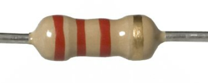
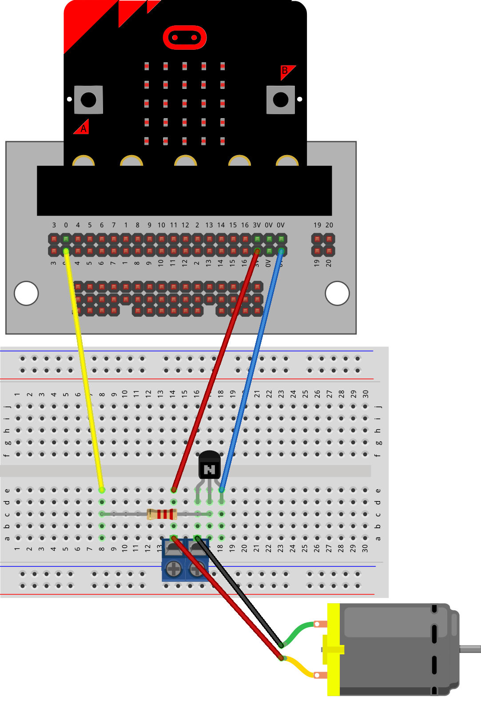
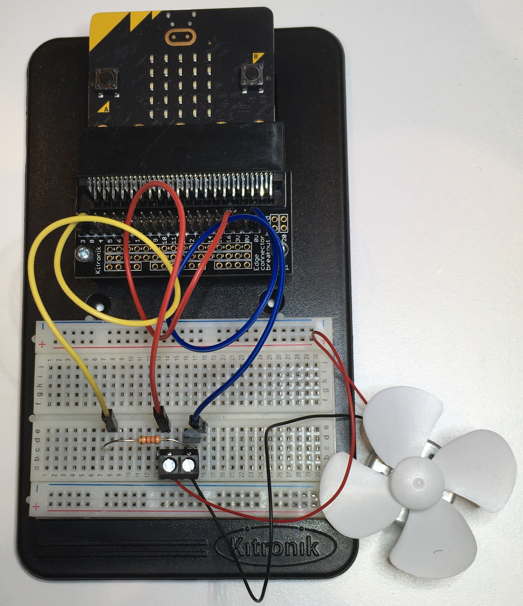
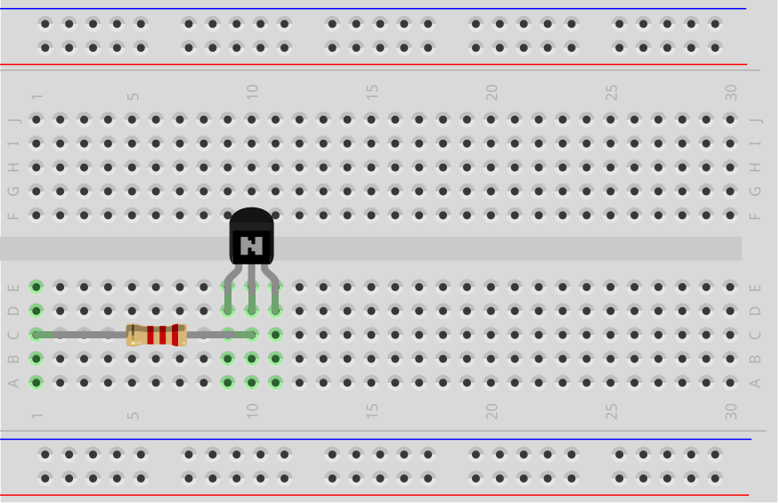
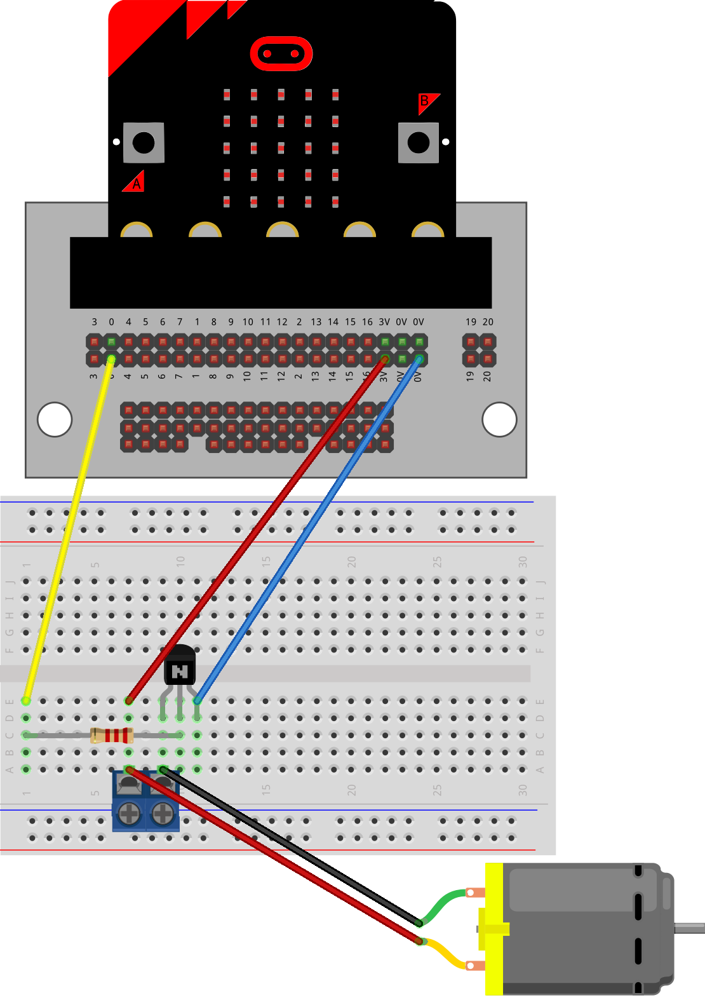
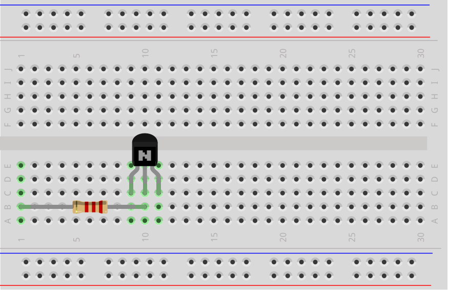
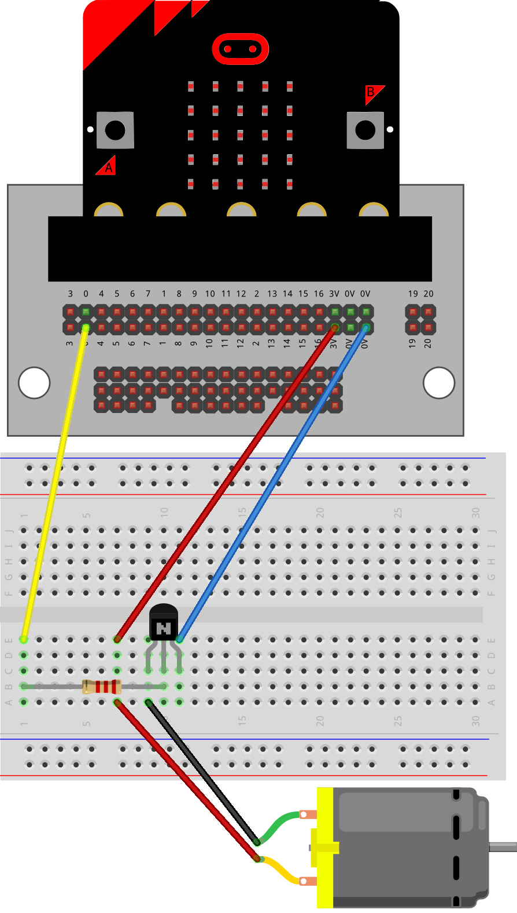

==========================
Motor_with_transistor_1
==========================

Making a Motor Move
==========================

In this lesson you will:

* Build a motor circuit.
* Learn why we use a transistor.
* Turn a motor ON and OFF using Python.
* Use the micro:bit buttons to control the motor.

----

Before you start
----------------------------------------

A micro:bit cannot send enough power to run a motor by itself.

We use:

* A **transistor** to control the motor.
* A **resistor** to protect the transistor.

The transistor acts like a switch.

The micro:bit tells the transistor:

* Turn ON → motor runs.
* Turn OFF → motor stops.

----

Connections
----------------------------------------

The motor needs a:

**2.2 k ohm resistor**

The resistor has these colour bands:

* Red
* Red
* Red
* Gold

The resistor connects to the transistor.

The transistor then controls the motor.

----

Building the circuit
----------------------------------------

Follow these steps:

#. Place the resistor first.
#. Place the transistor.
#. Make sure the flat side of the transistor faces forwards.
#. Connect the motor.
#. Add the jumper wires.

.. image:: images/motor_1b_bb.png
    :scale: 50 %

----

Alternative motor connection
----------------------------------------

Sometimes the motor is moved to the side.

This makes it easier to connect the terminal block.

Follow these steps:

#. Place the resistor.
#. Place the transistor.
#. Make sure the flat side faces forwards.
#. Connect the motor wires.
#. Connect the jumper wires.

----

Motor without terminal block
----------------------------------------

Some motors connect using wires directly.

Follow these steps:

#. Place the resistor.
#. Place the transistor.
#. Make sure the flat side faces forwards.
#. Connect the motor wires.
#. Connect the jumper wires.

----

Controlling the motor
----------------------------------------

We use:

``write_digital()``

This gives the motor two choices:

``1``

Motor ON

``0``

Motor OFF

----

write_digital
----------------------------------------

.. py:function:: pinx.write_digital(value)
    :no-index:

    | ``pinx`` is the pin connected to the motor.
    |
    | Examples:
    |
    | * ``pin0``
    | * ``pin1``
    | * ``pin2``
    |
    | ``value`` can be:
    |
    | * ``1`` = ON
    | * ``0`` = OFF

To turn the motor on:

``pin0.write_digital(1)``

To turn the motor off:

``pin0.write_digital(0)``

----

Using the buttons
----------------------------------------

Try this program.

Press:

* Button A → motor ON
* Button B → motor OFF

.. code-block:: python

    from microbit import *

    while True:
        if button_a.is_pressed():
            pin0.write_digital(1)

        elif button_b.is_pressed():
            pin0.write_digital(0)

        sleep(500)

----

Think about it
----------------------------------------

Answer these questions:

1. Which button starts the motor?

2. Which button stops the motor?

3. What number turns the motor ON?

4. What number turns the motor OFF?

----

Motor timing challenges
----------------------------------------

Try these challenges.

----

Challenge 1
----------------------------------------

Make the motor:

* Turn ON for 6 seconds.
* Turn OFF for 2 seconds.
* Repeat forever.

Hint:

Use:

``sleep(6000)``

for 6 seconds.

.. dropdown:: Challenge 1 Solution
        :icon: codescan
        :color: primary
        :class-container: sd-dropdown-container

        .. code-block:: python

            from microbit import *

            while True:
                pin0.write_digital(1)
                sleep(6000)

                pin0.write_digital(0)
                sleep(2000)

----

Challenge 2
----------------------------------------

Make the motor:

Button A:

* ON for 6 seconds.
* OFF for 2 seconds.

Button B:

* ON for 2 seconds.
* OFF for 6 seconds.

.. dropdown:: Challenge 2 Solution
        :icon: codescan
        :color: primary
        :class-container: sd-dropdown-container

        .. code-block:: python

            from microbit import *

            while True:
                if button_a.is_pressed():
                    pin0.write_digital(1)
                    sleep(6000)

                    pin0.write_digital(0)
                    sleep(2000)

                elif button_b.is_pressed():
                    pin0.write_digital(1)
                    sleep(2000)

                    pin0.write_digital(0)
                    sleep(6000)

----

Challenge 3
----------------------------------------

Make the motor:

Button A:

* ON for 6 seconds.
* OFF for 2 seconds.

Button B:

* ON for 2 seconds.
* OFF for 6 seconds.

Nothing pressed:

* ON for 4 seconds.
* OFF for 4 seconds.

.. dropdown:: Challenge 3 Solution
        :icon: codescan
        :color: primary
        :class-container: sd-dropdown-container

        .. code-block:: python

            from microbit import *

            while True:
                if button_a.is_pressed():
                    pin0.write_digital(1)
                    sleep(6000)

                    pin0.write_digital(0)
                    sleep(2000)

                elif button_b.is_pressed():
                    pin0.write_digital(1)
                    sleep(2000)

                    pin0.write_digital(0)
                    sleep(6000)

                else:
                    pin0.write_digital(1)
                    sleep(4000)

                    pin0.write_digital(0)
                    sleep(4000)

----

Lesson Review
----------------------------------------

Before moving to the next lesson, check that you can do these things.

.. admonition:: ✔ Lesson Checklist

    Can you:

    ☐ Explain why a transistor is needed to control a motor.

    ☐ Explain why the transistor needs a resistor.

    ☐ Build the motor circuit correctly.

    ☐ Use ``write_digital(1)`` to start the motor.

    ☐ Use ``write_digital(0)`` to stop the motor.

    ☐ Use the A and B buttons to control the motor.

    ☐ Use ``sleep()`` to control how long the motor runs.

    ☐ Change a program so the motor runs for different amounts of time.