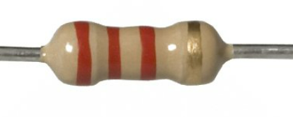
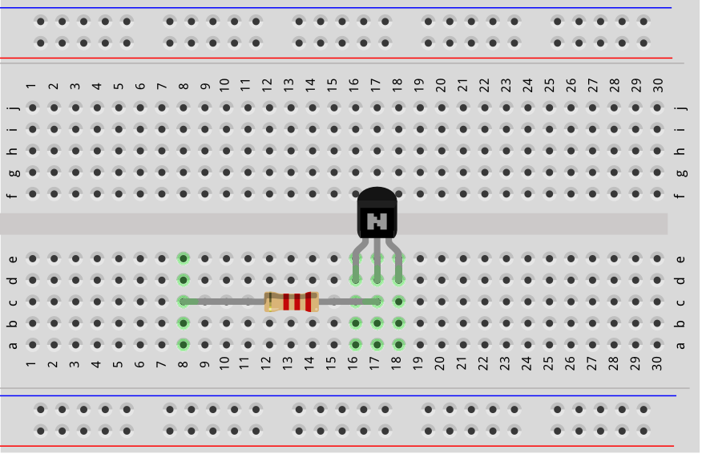
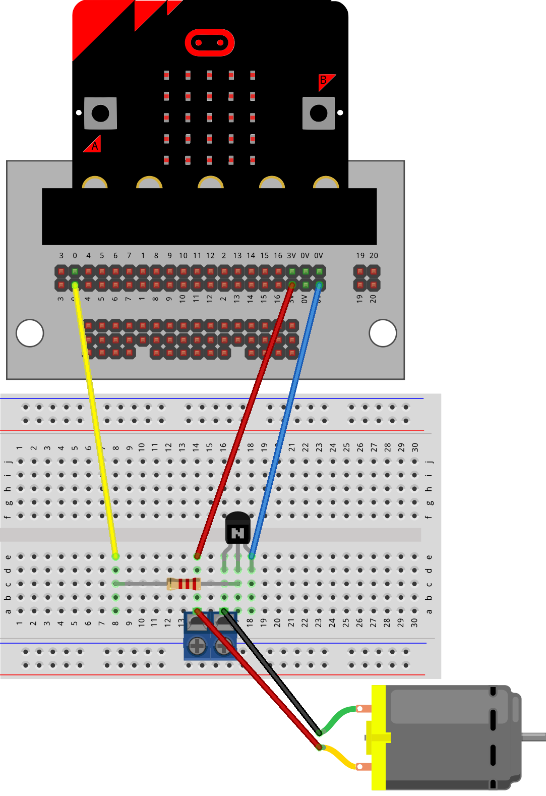
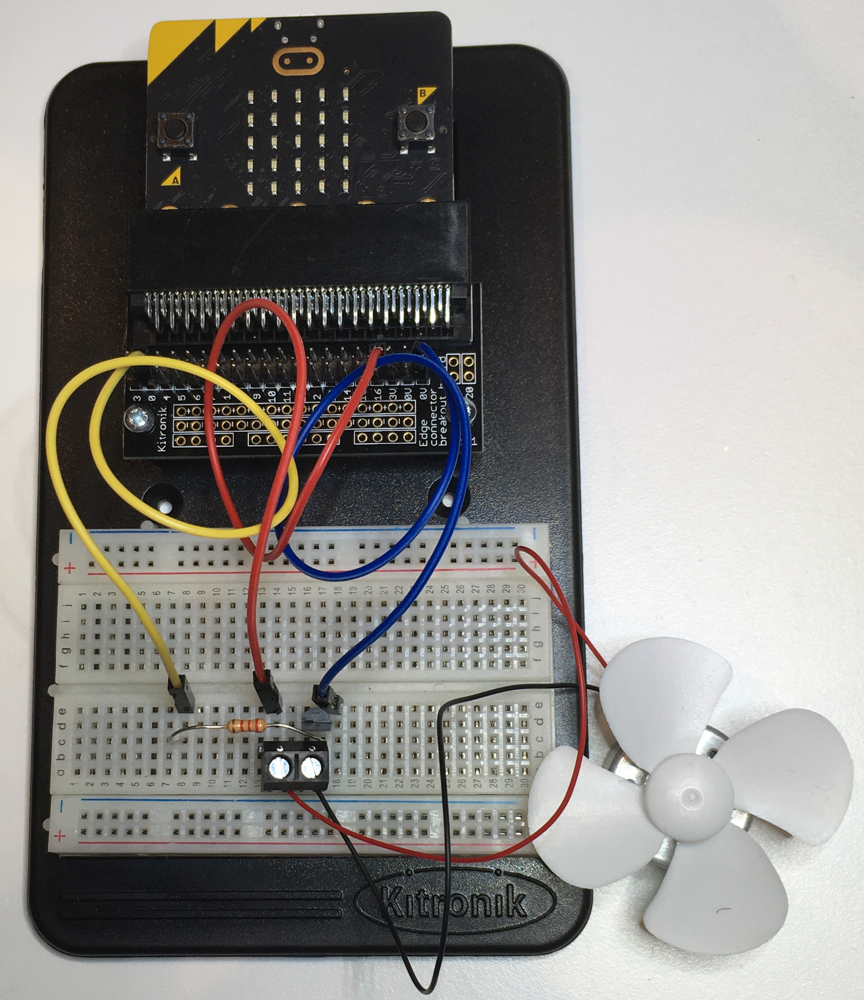
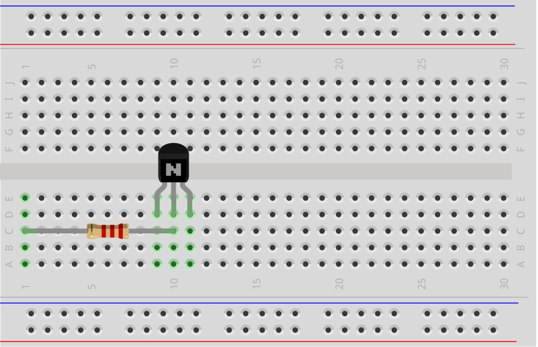
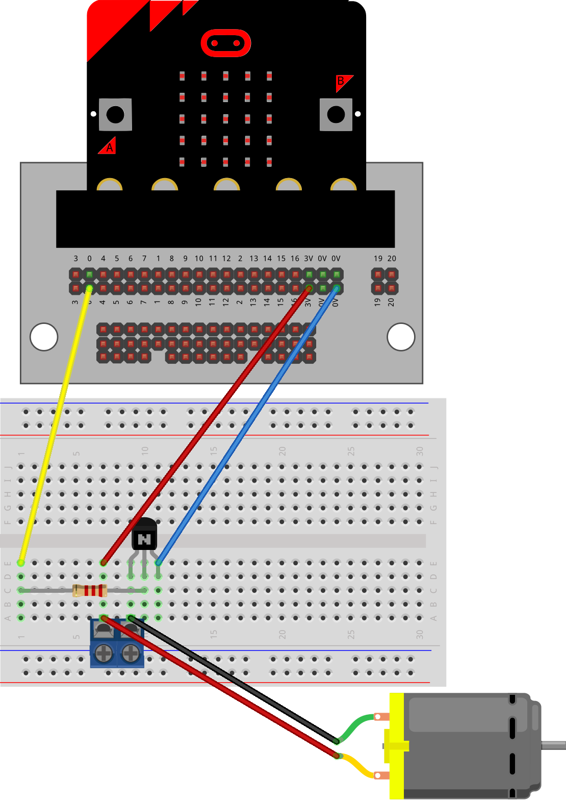
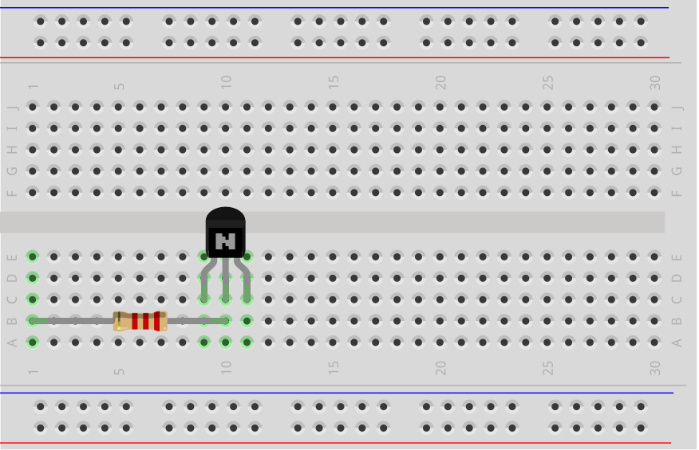
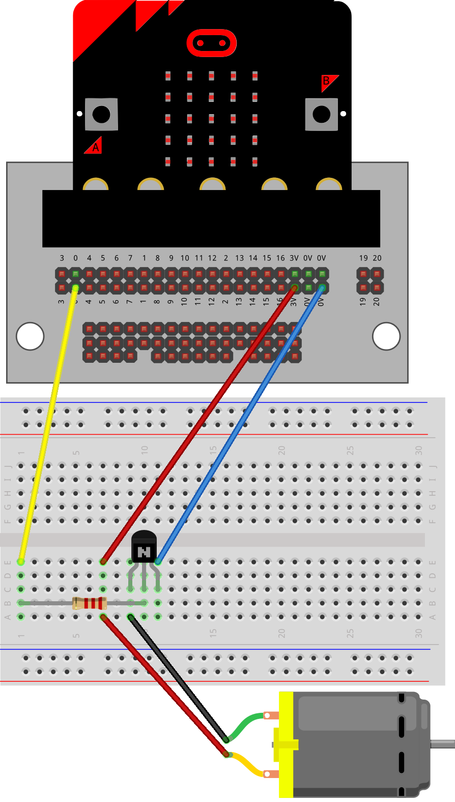

==========================
Motor_with_transistor_1
==========================

Making a Motor Move
==========================

In this lesson you will:

* Build a motor circuit.
* Learn why we use a transistor.
* Turn a motor ON and OFF using Python.
* Use the micro:bit buttons to control the motor.

----

Before you start
----------------------------------------

A micro:bit cannot send enough power to run a motor by itself.

We use:

* A **transistor** to control the motor.
* A **resistor** to protect the transistor.
* A **2.2 k ohm resistor** with colour bands: Red, Red, Red, Gold

The transistor acts like a switch.

The micro:bit tells the transistor:

* Turn ON → motor runs.
* Turn OFF → motor stops.

----

Building the circuit
----------------------------------------

Follow these steps:

#. Place the resistor first.
#. Place the transistor.
#. Make sure the flat side of the transistor faces forwards.
#. Connect the motor.
#. Add the jumper wires.

----

Alternative motor connection
----------------------------------------

Sometimes the motor is moved to the side.

This makes it easier to connect the terminal block.

Follow these steps:

#. Place the resistor.
#. Place the transistor.
#. Make sure the flat side faces forwards.
#. Connect the motor wires.
#. Connect the jumper wires.

----

Motor without terminal block
----------------------------------------

Some motors connect using wires directly.

Follow these steps:

#. Place the resistor.
#. Place the transistor.
#. Make sure the flat side faces forwards.
#. Connect the motor wires.
#. Connect the jumper wires.

----

Controlling the motor
----------------------------------------

| Use the ``write_digital(1)`` command to turn the Motor ON.
| Use the ``write_digital(0)`` command to turn the Motor OFF.

| For example:
| Turn on the Motor connected to pin0:
| ``pin0.write_digital(1)``

| Turn off the Motor connected to pin0:
| ``pin0.write_digital(0)``

----

Control the Motor with Button A
----------------------------------------

Fix the indenting in the code below to do this:

* Press **Button A** → the Motor turns **ON**
* No press → the Motor turns **OFF**

.. ordering::
    :no-padding:
    :no-reorder:
    :show-code:

    from microbit import *

    while True:
        if button_a.is_pressed():
            pin0.write_digital(1)
        else:
            pin0.write_digital(0)
        sleep(500)

----

Control the Motor with Buttons A and B
----------------------------------------

Fix the indenting in the code below to do this:

* Press **Button A** → the Motor turns **ON**
* Press **Button B** → the Motor turns **OFF**

.. ordering::
    :no-padding:
    :no-reorder:
    :show-code:

    from microbit import *

    while True:
        if button_a.is_pressed():
            pin0.write_digital(1)
        elif button_b.is_pressed():
            pin0.write_digital(0)
        sleep(500)
----

Motor timing challenges
----------------------------------------

Try these challenges.

----

Challenge 1
----------------------------------------

Make the motor:

* Turn ON for 6 seconds.
* Turn OFF for 2 seconds.
* Repeat forever.

.. cloze::
    :show-code:

    from microbit import *

    while True:
        pin0.write_digital(1)
        sleep(@@6000@@)
        pin0.write_digital(0)
        sleep(@@2000@@)

----

Challenge 2
----------------------------------------

Make the motor:

Button A:

* ON for 6 seconds.
* OFF for 2 seconds.

Button B:

* ON for 2 seconds.
* OFF for 6 seconds.

.. cloze::
    :show-code:

    from microbit import *

    while True:
        if button_a.is_pressed():
            pin0.write_digital(@@1@@)
            sleep(@@6000@@)
            pin0.write_digital(@@0@@)
            sleep(@@2000@@)

        elif button_b.is_pressed():
            pin0.write_digital(1)
            sleep(@@2000@@)
            pin0.write_digital(0)
            sleep(@@6000@@)

----

Challenge 3
----------------------------------------

Make the motor:

Button A:

* ON for 6 seconds.
* OFF for 2 seconds.

Button B:

* ON for 2 seconds.
* OFF for 6 seconds.

Nothing pressed:

* ON for 4 seconds.
* OFF for 4 seconds.

.. cloze::
    :show-code:

    from microbit import *

    while True:
        if button_a.is_pressed():
            pin0.write_digital(@@1@@)
            sleep(@@6000@@)
            pin0.write_digital(@@0@@)
            sleep(@@2000@@)

        elif button_b.is_pressed():
            pin0.write_digital(1)
            sleep(@@2000@@)
            pin0.write_digital(0)
            sleep(@@6000@@)

        else:
            pin0.write_digital(@@1@@)
            sleep(@@4000@@)
            pin0.write_digital(@@0@@)
            sleep(@@4000@@)
