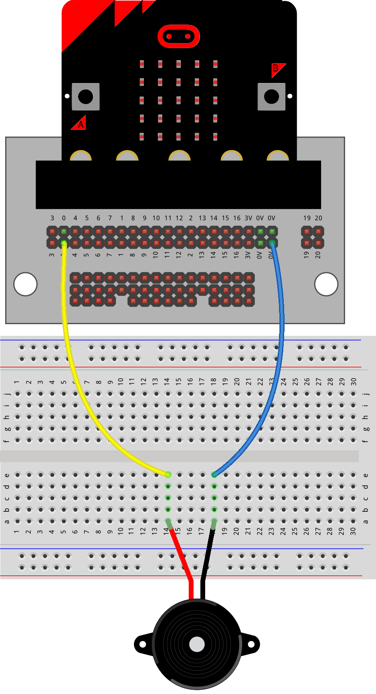

==========================
Piezo_Buzzer_1
==========================

Making Sounds with a Piezo Buzzer
=================================

In this lesson you will learn how to:

* Connect a piezo buzzer.
* Use the ``music`` library.
* Play single notes.
* Play a short tune.

----

What is a piezo buzzer?
----------------------------------------

A piezo buzzer makes sounds.

The micro:bit can play:

* Notes
* Tunes
* Sound effects

The buzzer is connected to **pin0**.

----

Using the built-in speaker
----------------------------------------

If you are using:

**A buzzer on a breadboard**

Turn the built-in speaker **OFF**.

If you are using:

**A V2 micro:bit speaker**

Turn the built-in speaker **ON**.

This lesson uses a **breadboard buzzer**, so we will use:

``speaker.off()``

----

Build the circuit
----------------------------------------

Follow these steps.

#. Place the buzzer into the breadboard.
#. Connect one side to **pin0**.
#. Connect the other side to **Ground (0V)**.

.. image:: images/buzzer.jpg
    :scale: 30 %

----

Using the music library
----------------------------------------

To play sounds we need another library.

Add this line underneath:

``from microbit import *``

.. code-block:: python

    import music

----

Your first sound
----------------------------------------

This program plays one note.

The note is:

``C``

.. code-block:: python

    from microbit import *
    import music

    speaker.off()

    music.play("c")

----

Try These
----------------------------------------

Change the note.

Try:

* ``"d"``
* ``"e"``
* ``"f"``
* ``"g"``
* ``"a"``
* ``"b"``

What sounds different?

----

Playing several notes
----------------------------------------

Instead of one note,

we can play a list of notes.

This program plays five notes.

.. code-block:: python

    from microbit import *
    import music

    speaker.off()

    notes = ["c", "d", "e", "f", "g"]

    music.play(notes)

----

Another example
----------------------------------------

This tune goes up,

then back down again.

.. code-block:: python

    from microbit import *
    import music

    speaker.off()

    notes = ["c", "d", "e", "d", "c"]

    music.play(notes)

----

Using the buttons
----------------------------------------

Press:

* **Button A** → Play the tune.

.. code-block:: python

    from microbit import *
    import music

    speaker.off()

    notes = ["c", "d", "e", "d", "c"]

    while True:

        if button_a.is_pressed():

            music.play(notes)

        sleep(200)

----

Worked Example
----------------------------------------

This tune uses only two notes.

Can you see the pattern?

.. code-block:: python

    from microbit import *
    import music

    speaker.off()

    notes = ["c", "g", "c", "g", "c"]

    while True:

        if button_a.is_pressed():

            music.play(notes)

        sleep(200)

----

Try These
----------------------------------------

**Example 1**

Change the program to play:

* C
* E
* G

before pressing Button A.

----

**Example 2**

Change the program to play:

* G
* F
* E
* D
* C

----

**Example 3**

Make your own tune using:

* C
* D
* E

Use five notes.

----

**Example 4**

Make your own tune using:

* C
* E
* G

Use six notes.

----

.. dropdown:: Challenge Solutions
    :icon: codescan
    :color: primary
    :class-container: sd-dropdown-container

    .. tab-set::

        .. tab-item:: Example 1

            .. code-block:: python

                from microbit import *
                import music

                speaker.off()

                notes = ["c", "e", "g"]

                while True:

                    if button_a.is_pressed():

                        music.play(notes)

                    sleep(200)

        .. tab-item:: Example 2

            .. code-block:: python

                from microbit import *
                import music

                speaker.off()

                notes = ["g", "f", "e", "d", "c"]

                while True:

                    if button_a.is_pressed():

                        music.play(notes)

                    sleep(200)

----

Challenge
----------------------------------------

Can you make a tune that:

* Starts with C.
* Ends with C.
* Uses at least six notes.

Try different note patterns until you find one you like.

----

Lesson Review
----------------------------------------

Before moving to the next lesson, check that you can do these things.

.. admonition:: ✔ Lesson Checklist

    Can you:

    ☐ Build the buzzer circuit.

    ☐ Import the ``music`` library.

    ☐ Turn the built-in speaker off when using a breadboard buzzer.

    ☐ Use ``music.play()`` to play one note.

    ☐ Create a list of notes.

    ☐ Use ``music.play()`` to play a list of notes.

    ☐ Change a tune by editing the notes in the list.

    ☐ Use Button A to play a tune.