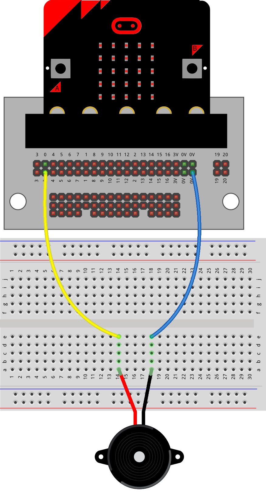
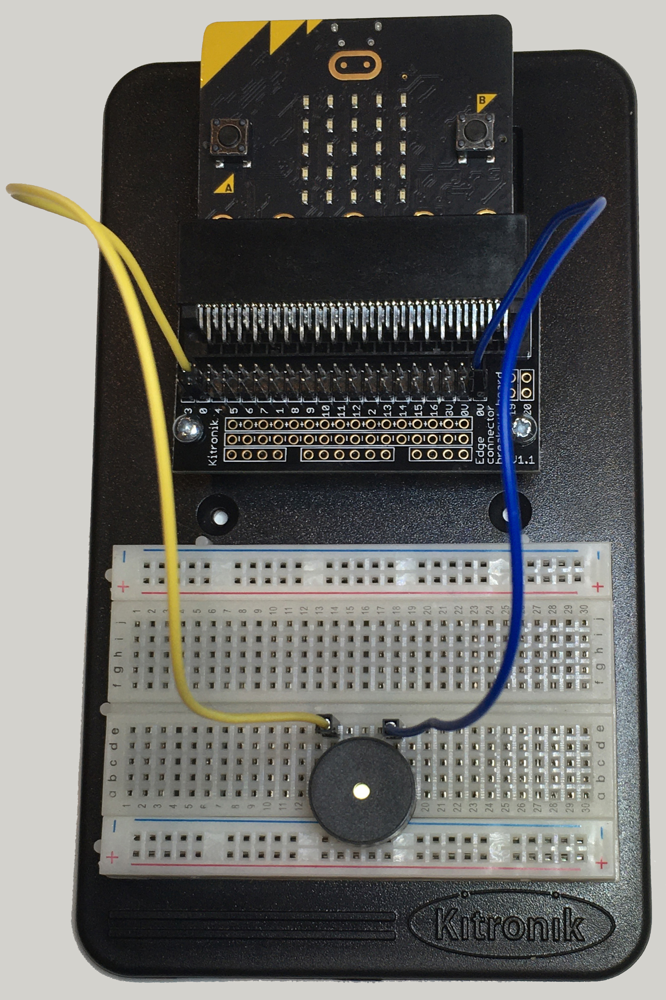

====================================
Piezo_Buzzer_1
====================================

Making Sounds with a Piezo Buzzer
====================================

In this lesson you will learn how to:

* Connect a piezo buzzer.
* Use the ``music`` library.
* Play single notes.
* Play a short tune.

----

Build the circuit
----------------------------------------

Follow these steps.

#. Place the buzzer into the breadboard.
#. Connect one side to **pin0**.
#. Connect the other side to **Ground (0V)**.

----

Using the music library
----------------------------------------

| To play sounds we need the ``music`` library.
| If you are using: **A buzzer on a breadboard**, turn the built-in speaker **OFF** using ``speaker.off()``

.. code-block:: python

    from microbit import *
    import music

    speaker.off()

----

Play a single note
----------------------------------------

| Play a single note using the ``music.play()`` command.
| The note is: ``C``

.. code-block:: python

    from microbit import *
    import music

    speaker.off()
    music.play("c")

----

Change the note
----------------------------------------

.. admonition:: Try it yourself
    :class: task

    Try each note: ``"d"``, ``"e"``, ``"f"``, ``"g"``, ``"a"``, ``"b"``

----

Playing several notes
----------------------------------------

| Play a list of notes using the ``music.play()`` command.
| This program plays five notes.

.. code-block:: python

    from microbit import *
    import music

    speaker.off()
    notes = ["c", "d", "e", "f", "g"]
    music.play(notes)

----

Another example
----------------------------------------

This tune goes up, then back down again.

.. code-block:: python

    from microbit import *
    import music

    speaker.off()
    notes = ["c", "d", "e", "d", "c"]
    music.play(notes)

----

Using the buttons
----------------------------------------

Press: **Button A** → Play the tune.

.. cloze::
    :show-code:

    from microbit import *
    import @@music@@

    speaker.off()
    @@notes@@ = ["c", "d", "e", "d", "c"]

    while True:
        if button_a.is_pressed():
            @@music@@.@@play@@(notes)
        sleep(200)

----

Try These
----------------------------------------

.. admonition:: Try it yourself
    :class: task

    * Try making your own tune.
    * Try using button A for one list of notes and button B for another list of notes.

