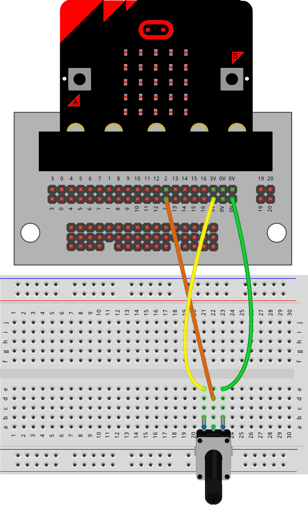
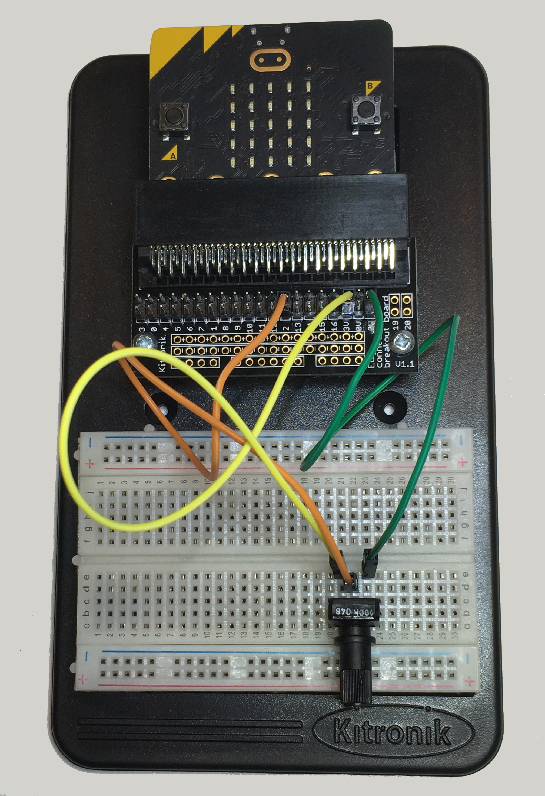

==========================
Potentiometer
==========================

Reading a Potentiometer
==========================

In this lesson you will learn how to:

* Connect a potentiometer.
* Read its value.
* Display the value on the micro:bit.
* Scale the value to a smaller range.

----

What is a potentiometer?
----------------------------------------

| A **potentiometer** is a variable resistor.
| It is sometimes called a **pot**.
| You can turn the knob to change its value.
| As you turn it the micro:bit can measure the change and display it.

You can use a potentiometer to control things such as:

    * Motor speed
    * LED brightness
    * Sound volume

----

Build the circuit
----------------------------------------

Follow these steps:

#. Place the potentiometer.
#. Connect the jumper wires.

----

Reading the potentiometer analog value
----------------------------------------

| To read the potentiometer, use: ``pin2.read_analog()``
| Turn the knob slowly. Watch the numbers change.
| The value can be between:

    * ``0`` (one end)
    * ``1023`` (the other end)

| Fix the indenting in the code below to do this:

.. ordering::
    :no-padding:
    :no-reorder:
    :show-code:

    from microbit import *

    while True:
        pot_val = pin2.read_analog()
        display.scroll(pot_val, delay=80)
        sleep(20)

----

Think about it
----------------------------------------

Try turning the knob.

Can you answer these questions?

* What is the smallest number you can see?
* What is the largest number you can see?
* Do the numbers increase or decrease as you turn the knob to the left or right?
