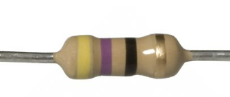
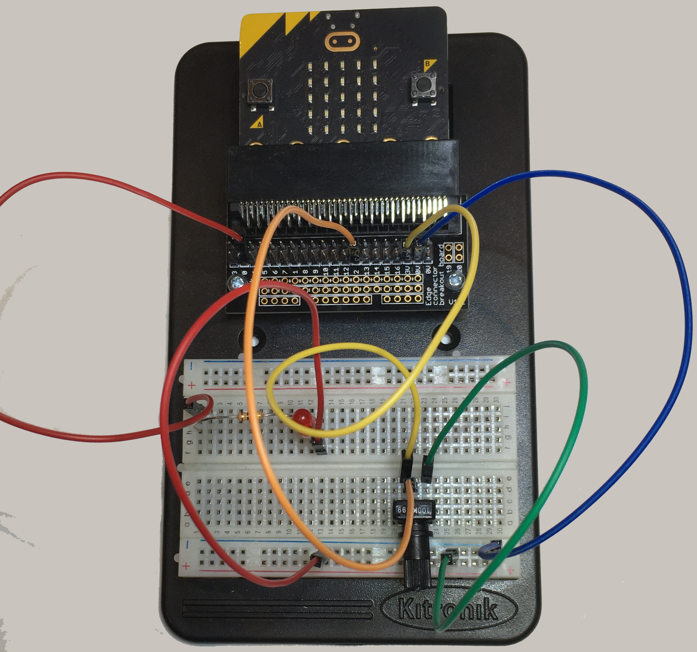

==========================
Potentiometer_with_LED
==========================

Controlling an LED with a Potentiometer
=======================================

In this lesson you will learn how to:

* Read a potentiometer.
* Control an LED using the potentiometer.
* Change LED brightness.
* Use ``if`` statements to control different LEDs.

----

Building the circuit
----------------------------------------

The LED must be connected with a **47 ohm resistor**.

The resistor protects the LED.

The 47 ohm resistor has these colour bands:

* Yellow
* Violet
* Black
* Gold

----

Build the circuit
----------------------------------------

Follow these steps:

#. Place the resistor.
#. Place the LED.
#. Make sure the **long leg** of the LED is closest to the micro:bit pins.
#. Place the potentiometer.
#. Connect the jumper wires.

.. image:: images/potentiometer_1_bb.png
    :scale: 50 %

.. image:: images/potentiometer_2_bb.png
    :scale: 50 %

----

Reading and writing analog values
----------------------------------------

The potentiometer gives a value between:

* ``0``
* ``1023``

We can use this value to control the LED brightness.

As you turn the potentiometer:

* Small number → dim LED.
* Large number → bright LED.

----

Controlling LED brightness
----------------------------------------

This program:

* Reads the potentiometer.
* Uses the reading to control the LED brightness.

Turn the potentiometer slowly.

Watch what happens to the LED.

.. code-block:: python

    from microbit import *

    while True:
        pot_val = pin2.read_analog()
        pin0.write_analog(pot_val)
        sleep(40)

----

Think about it
----------------------------------------

Can you answer these questions?

* When is the LED brightest?
* When is the LED dimmest?
* What happens when the potentiometer is in the middle?

----

Challenge 1
----------------------------------------

Add a second LED.

Remember:

* The second LED also needs a **47 ohm resistor**.
* Connect it to **pin1**.

Use the potentiometer to control **both LEDs**.

.. dropdown:: Challenge 1 Solution
        :icon: codescan
        :color: primary
        :class-container: sd-dropdown-container

        .. code-block:: python

            from microbit import *

            while True:
                pot_val = pin2.read_analog()
                pin0.write_analog(pot_val)
                pin1.write_analog(pot_val)
                sleep(40)

----

Challenge 2
----------------------------------------

Make the LEDs have **opposite brightness**.

When one LED is bright:

* The other LED should be dim.

When one LED is dim:

* The other LED should be bright.

Hint:

``1023 - pot_val``

.. dropdown:: Challenge 2 Solution
        :icon: codescan
        :color: primary
        :class-container: sd-dropdown-container

        .. code-block:: python

            from microbit import *

            while True:
                pot_val = pin2.read_analog()
                pin0.write_analog(pot_val)
                pin1.write_analog(1023 - pot_val)
                sleep(40)

----

Using if statements
----------------------------------------

We can use an **if statement** to make decisions.

This program checks the potentiometer value.

If the value is:

* **500 or more**
    * Yellow LED turns ON.
    * Red LED turns OFF.

Otherwise:

* Red LED turns ON.
* Yellow LED turns OFF.

.. code-block:: python

    from microbit import *

    while True:
        pot_val = pin2.read_analog()

        if pot_val >= 500:
            pin0.write_digital(0)
            pin1.write_digital(1)

        else:
            pin0.write_digital(1)
            pin1.write_digital(0)

        sleep(40)

----

Challenge 3
----------------------------------------

Run the program.

Turn the potentiometer.

Can you find the point where the LEDs swap?

What value makes this happen?

----

Challenge 4
----------------------------------------

Add pictures to the micro:bit display.

When the:

* Yellow LED is ON → show ``Image.YES``

When the:

* Red LED is ON → show ``Image.NO``

Hint:

Use:

* ``display.show(Image.YES)``
* ``display.show(Image.NO)``

----

Extension Challenge
----------------------------------------

Add a third LED.

Connect it to:

* pin8

or

* pin12

Use:

* ``if``
* ``elif``
* ``else``

to divide the potentiometer into three ranges.

Example:

* 0-300 → Red LED
* 301-700 → Yellow LED
* 701-1023 → Green LED

Only one LED should be ON at a time.

----

Lesson Review
----------------------------------------

Before moving to the next lesson, check that you can do these things.

.. admonition:: ✔ Lesson Checklist

    Can you:

    ☐ Use ``read_analog()`` to read the potentiometer.

    ☐ Use ``write_analog()`` to change an LED's brightness.

    ☐ Explain how turning the potentiometer changes the LED brightness.

    ☐ Control two LEDs with one potentiometer.

    ☐ Make two LEDs have opposite brightness using ``1023 - value``.

    ☐ Use an ``if`` statement to control LEDs based on the potentiometer value.
