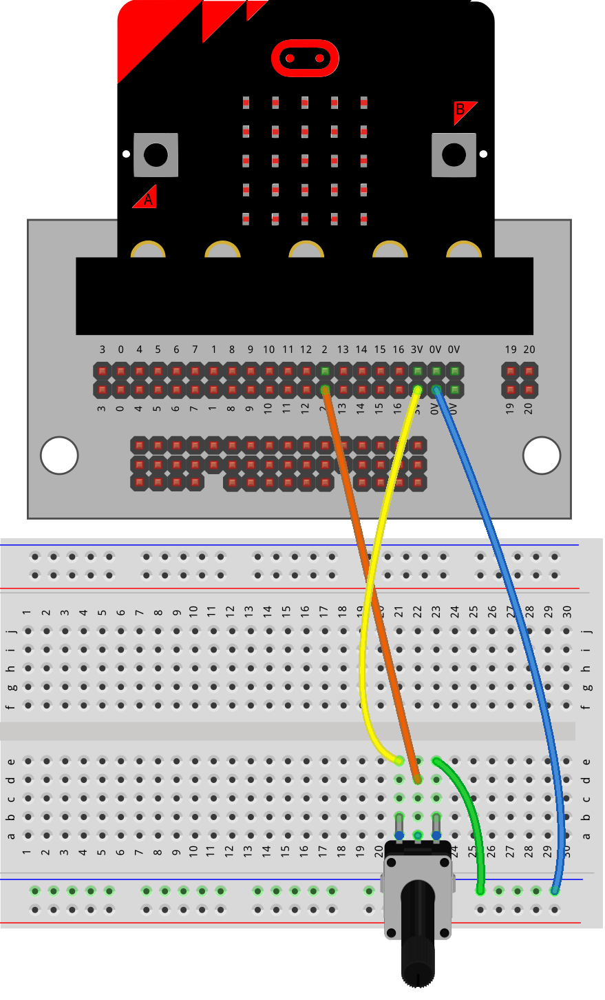
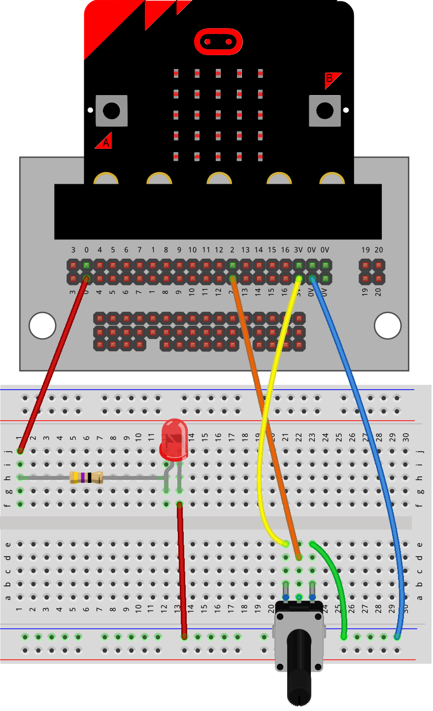
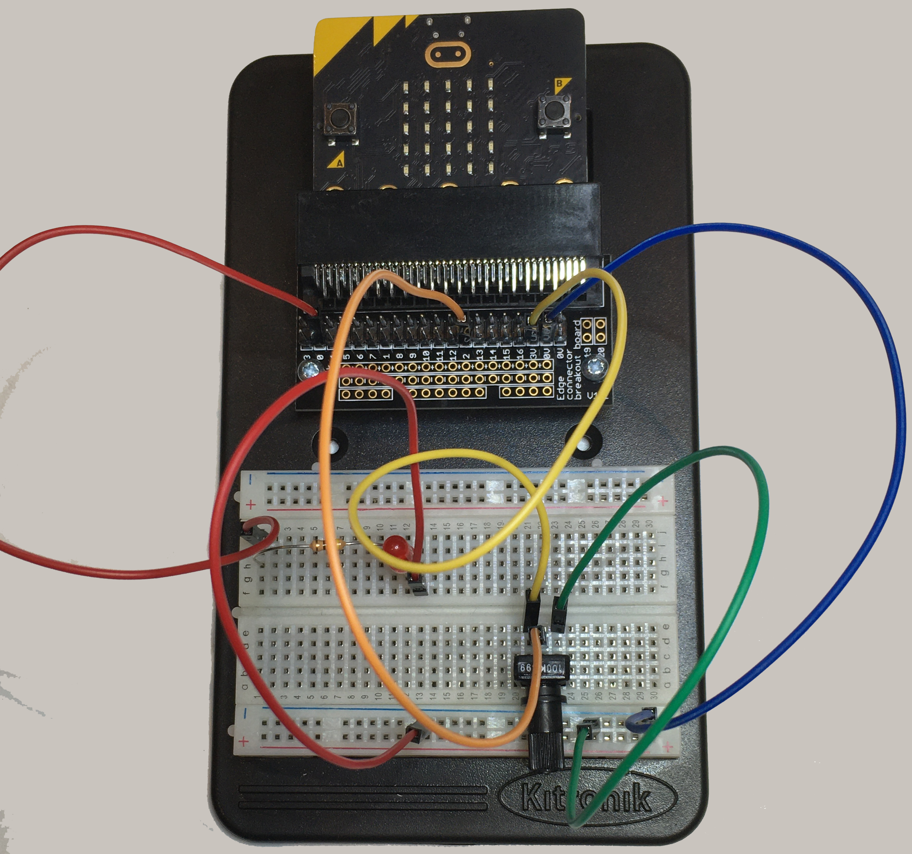

==========================
Potentiometer_with_LED
==========================

Controlling an LED with a Potentiometer
=======================================

In this lesson you will learn how to:

* Read a potentiometer.
* Control an LED using the potentiometer.
* Change LED brightness.
* Use ``if`` statements to control different LEDs.

----

Building the circuit
----------------------------------------

Follow these steps:

#. Place the 47 ohm resistor (bands of: yellow, violet, black, gold).
#. Place the LED.
#. Make sure the **long leg** of the LED is closest to the micro:bit pins.
#. Place the potentiometer.
#. Connect the jumper wires.

----

Controlling LED brightness
----------------------------------------

This program:

* Reads the potentiometer using ``pin2.read_analog()``
* Uses the reading to control the LED brightness using ``pin0.write_analog()``
* Small number → dim LED.
* Large number → bright LED.

Turn the potentiometer slowly. Watch what happens to the LED.

.. ordering::
    :show-code:

    from microbit import *

    while True:
        pot_val = pin2.read_analog()
        pin0.write_analog(pot_val)
        sleep(40)

----

Think about it
----------------------------------------

Can you answer these questions?

* When is the LED brightest?
* When is the LED dimmest?
* What happens when the potentiometer is in the middle?

----

Challenge 1
----------------------------------------

* Add a second LED. Connect it to **pin1**.
* The second LED also needs a **47 ohm resistor**.
* Use the potentiometer to control **both LEDs**.

.. cloze::
    :show-code:

    from microbit import *

    while True:
        pot_val = pin2.@@read_analog@@()
        pin0.@@write_analog@@(pot_val)
        pin1.@@write_analog@@(pot_val)
        sleep(40)

----

Challenge 2
----------------------------------------

| Make the LEDs have **opposite brightness**.
| When one LED is bright: the other LED should be dim.
| When one LED is dim: the other LED should be bright.
| Hint: use ``1023 - pot_val``

.. cloze::
    :show-code:

    from microbit import *

    while True:
        @@pot_val@@ = pin2.@@read_analog@@()
        pin0.@@write_analog@@(pot_val)
        pin1.write_analog(@@1023 - pot_val@@)
        sleep(40)

----

Challenge 3
----------------------------------------

| We can use an **if statement** to make decisions.
| This program checks the potentiometer value.
| Fix the indenting in the code below to do this:
| If the value is: **500 or more**

    * Yellow LED turns ON.
    * Red LED turns OFF.

| Otherwise:

    * Red LED turns ON.
    * Yellow LED turns OFF.

.. ordering::
    :no-padding:
    :no-reorder:
    :show-code:

    from microbit import *

    while True:
        pot_val = pin2.read_analog()

        if pot_val >= 500:
            pin0.write_digital(0)
            pin1.write_digital(1)

        else:
            pin0.write_digital(1)
            pin1.write_digital(0)

        sleep(40)

| Run the program.
| Turn the potentiometer.
| Can you find the point where the LEDs swap?
| What value makes this happen?

----

Try these challenges
----------------------------------------

.. admonition:: Try it yourself
    :class: task

    | Add pictures to the micro:bit display.
    | When the Yellow LED is ON → show ``Image.YES``
    | When the Red LED is ON → show ``Image.NO``

.. admonition:: Try it yourself
    :class: task

    | Add a third LED.
    | Connect it to pin8
    | To divide the potentiometer into three ranges, use:

        * ``if``
        * ``elif``
        * ``else``

    Example:

    * 0-300 → Red LED
    * 301-700 → Yellow LED
    * 701-1023 → Green LED

    Only one LED should be ON at a time.

