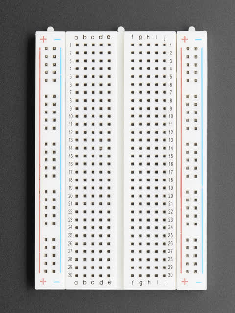
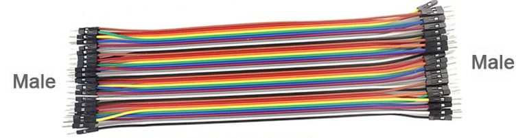

==========================
Breadboard connections
==========================

A breadboard lets you build electrical circuits.

----

Rows
--------------------------

Rows are numbered.

* Holes in the same numbered row are connected.
* Electricity can move between these holes.
* The two sides of the breadboard are **not** connected.

----

Rails
--------------------------

* The red (+) rail is connected all the way along.
* The blue (-) rail is connected all the way along.

----

Jumpers
--------------------------

Jumper wires join parts together.

Use **female-to-male** jumper wires to connect the edge connector pins to the breadboard holes.

.. image:: images/female_to_male_jumpers.jpg
    :scale: 100 %

| The female end pushes onto the edge connector.
| The male end plugs into the breadboard.

Use **male-to-male** jumper wires to connect holes on the breadboard.
