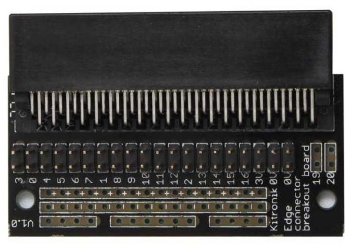
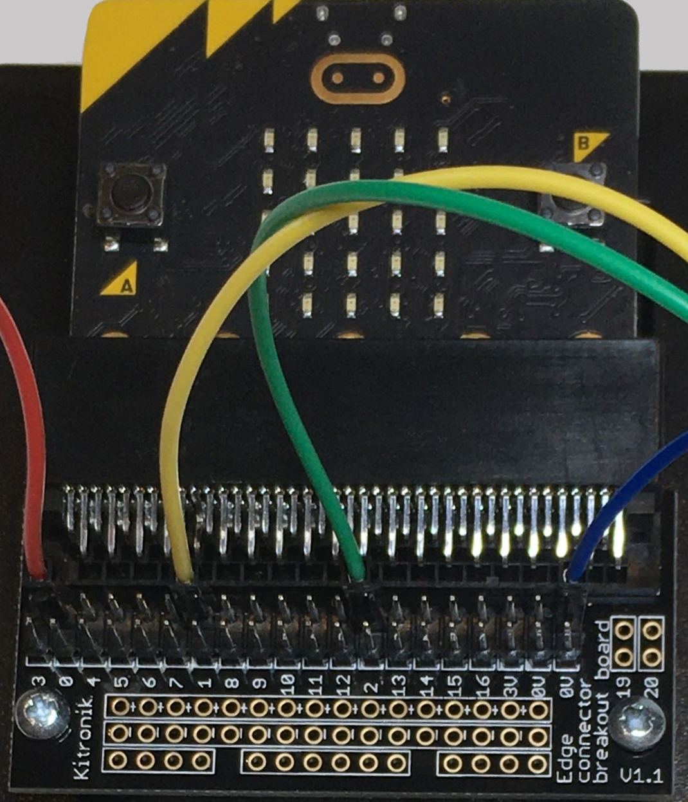

==========================
Edge Connector
==========================

Connecting the microbit
--------------------------

The edge connector lets the microbit plug into the breadboard.

The main pins are:

* pin0
* pin1
* pin2

* 3V (power)
* 0V (ground)

----

The microbit faces upwards.

