==========================
LEDs digital
==========================

Each LED needs a **47 ohm resistor** to protect it from too much electricity.

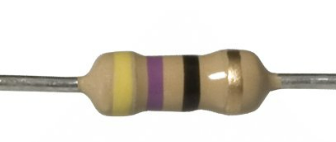

| Bend each resistor into a **U shape**.

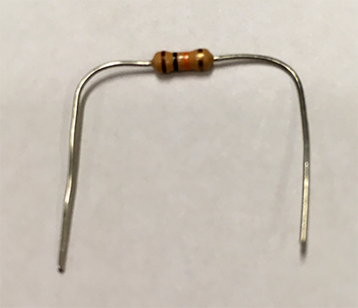

| Push the resistor legs into the breadboard.

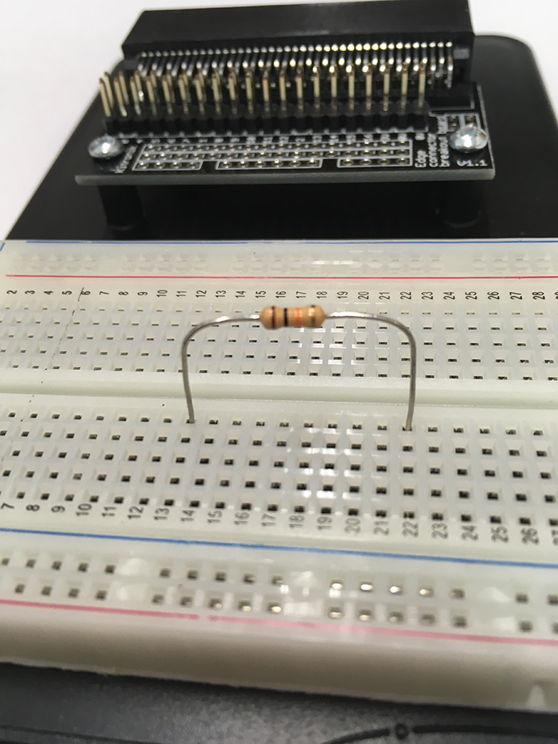

----

Building the circuit
--------------------------

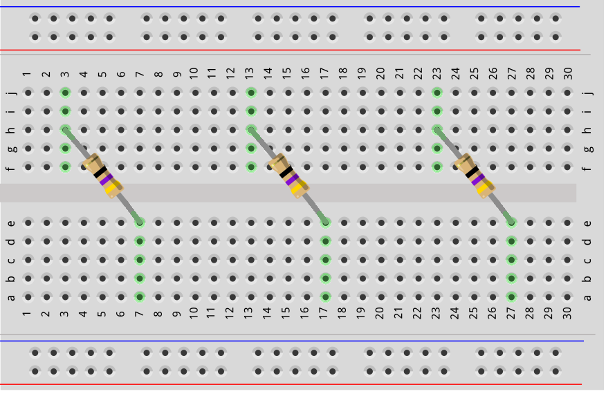

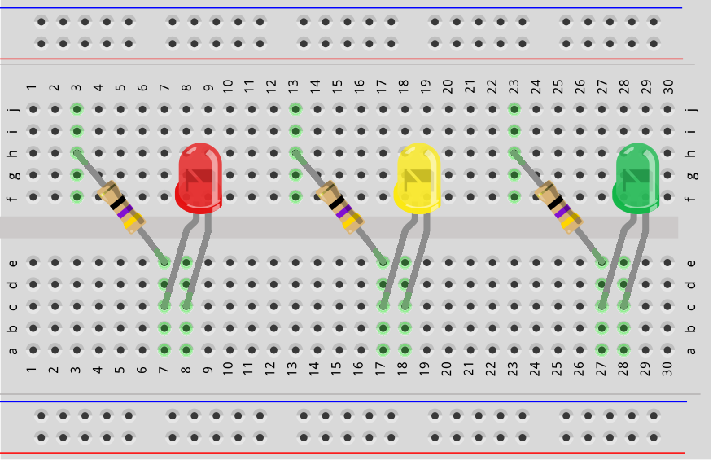

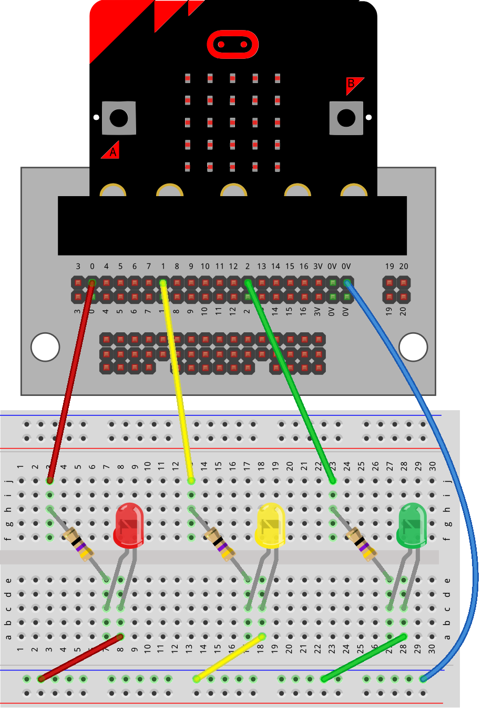

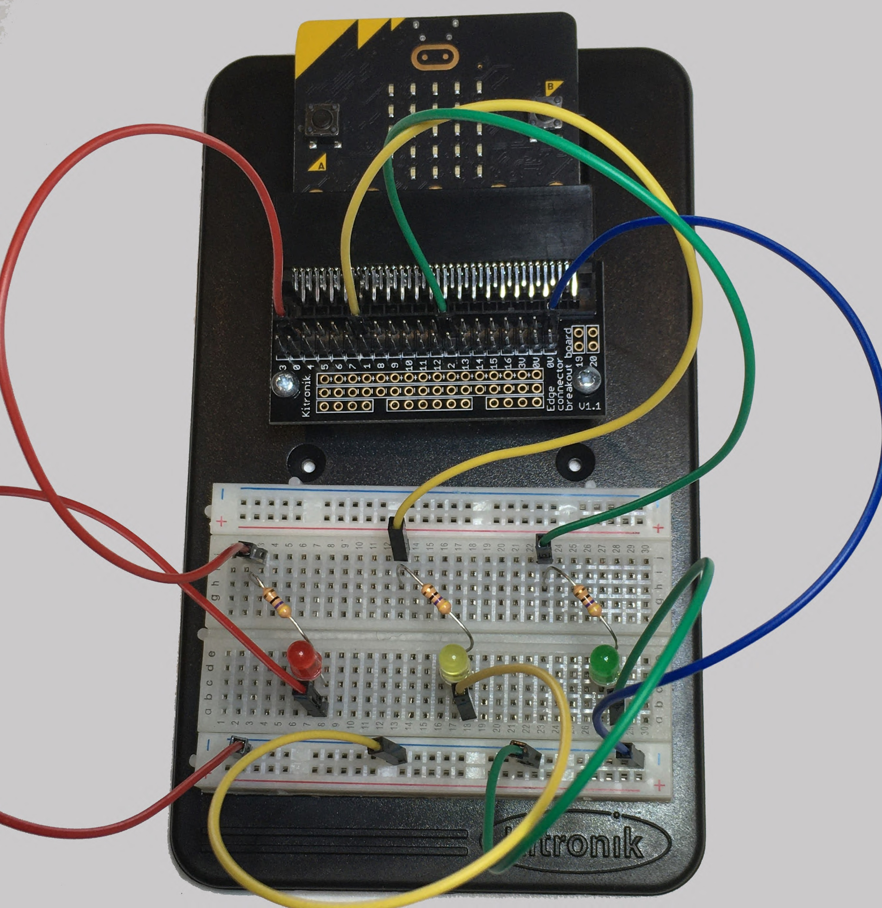

----

Turning an LED ON and OFF
----------------------------------------

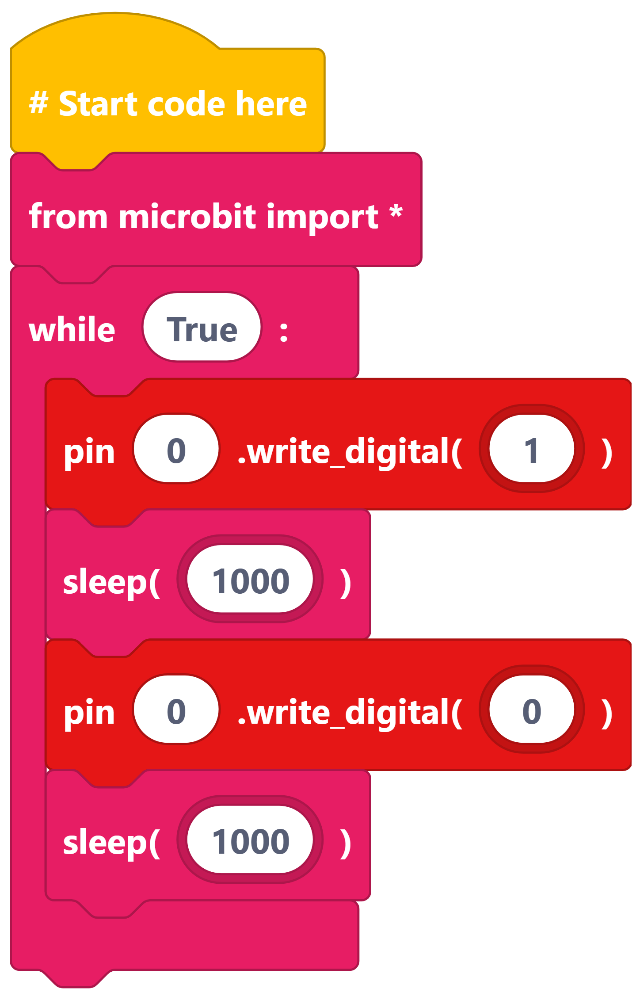

----

Control one LED with button A
----------------------------------------

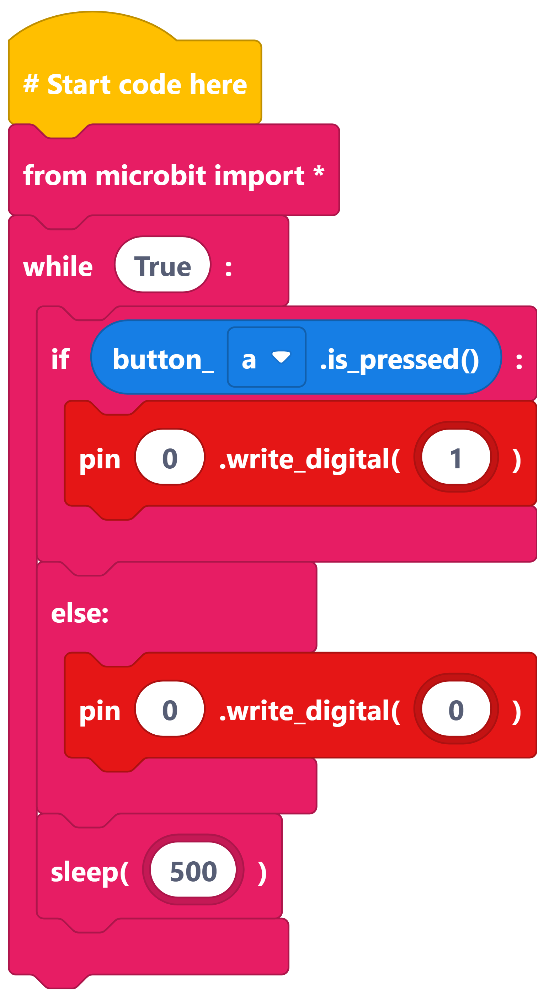

Control one LED with buttons A and B
----------------------------------------

* Press **Button A** → Red LED turns **ON**
* Press **Button B** → Red LED turns **OFF**

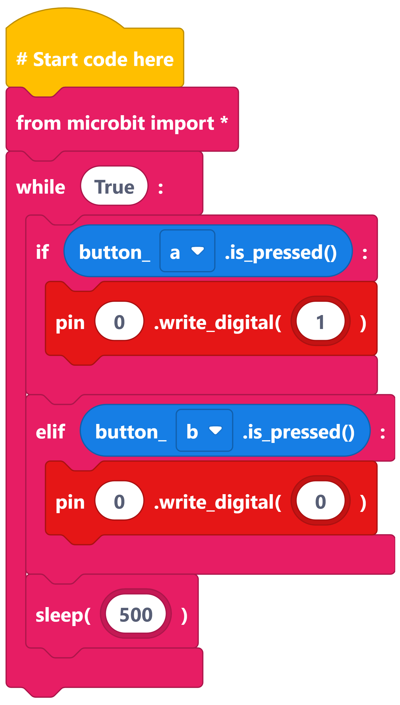

----

Control all three LEDs
----------------------------------------

* Press **Button A** → All LEDs turn ON.
* Press **Button B** → All LEDs turn OFF.

----

Try These Challenges
----------------------------------------

**Challenge 1**

| Press **A**:
| * Turn on the **red LED only** on pin0.
|
| Press **B**:
| * Turn on the **yellow and green LEDs only** on pin1 and pin2 respectively.

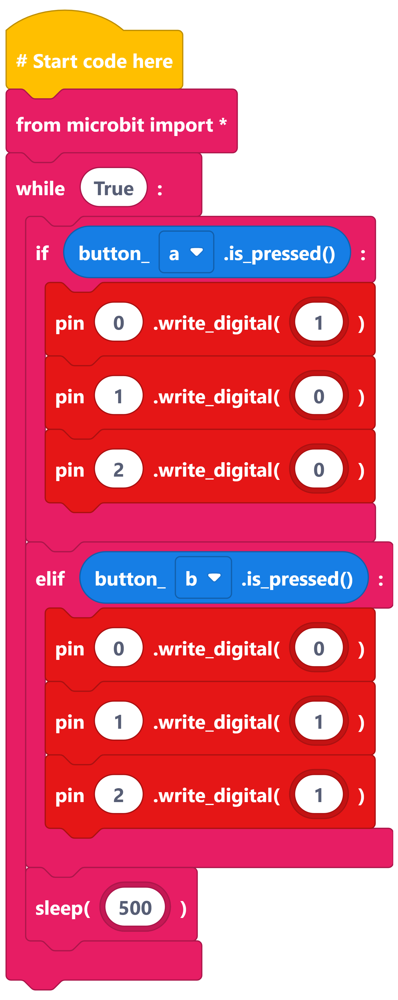

----

**Challenge 2**

| Press **A**:
| * Turn on the **green LED only** on pin2.
|
| Press **B**:
| * Turn on the **red and yellow LEDs only** on pin0 and pin1 respectively.

