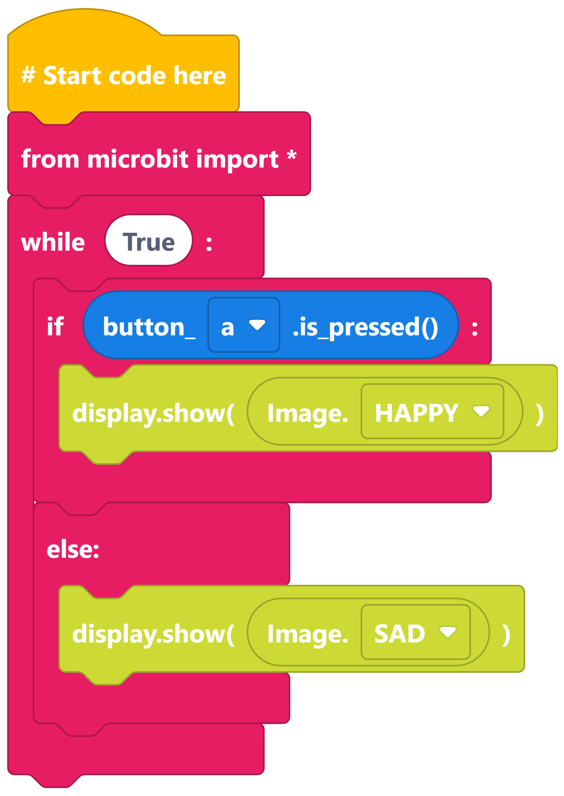
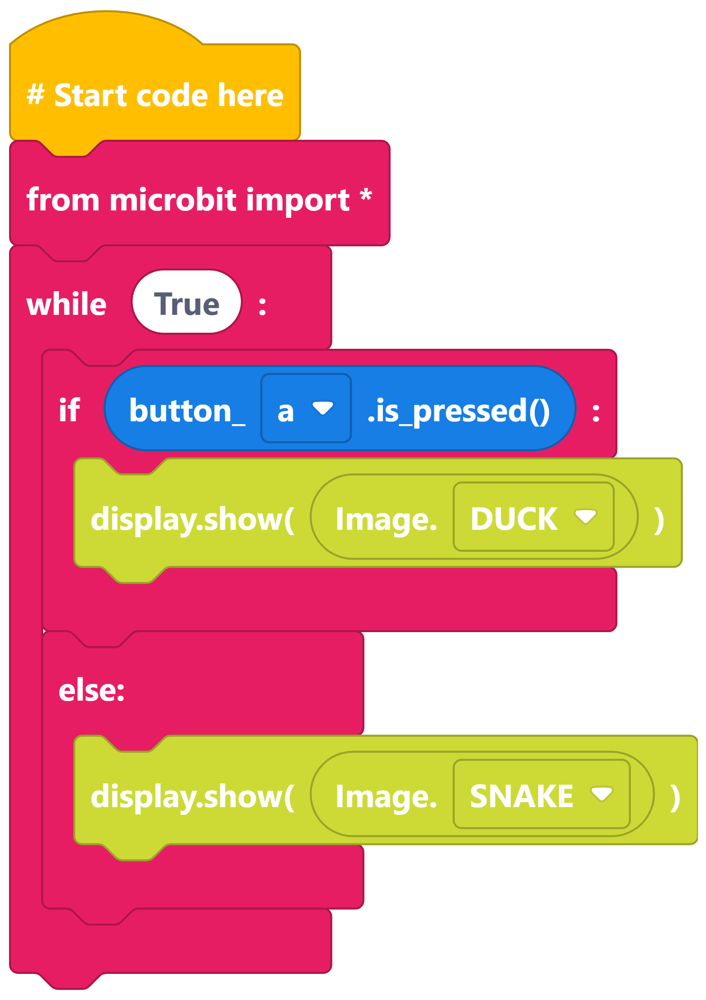
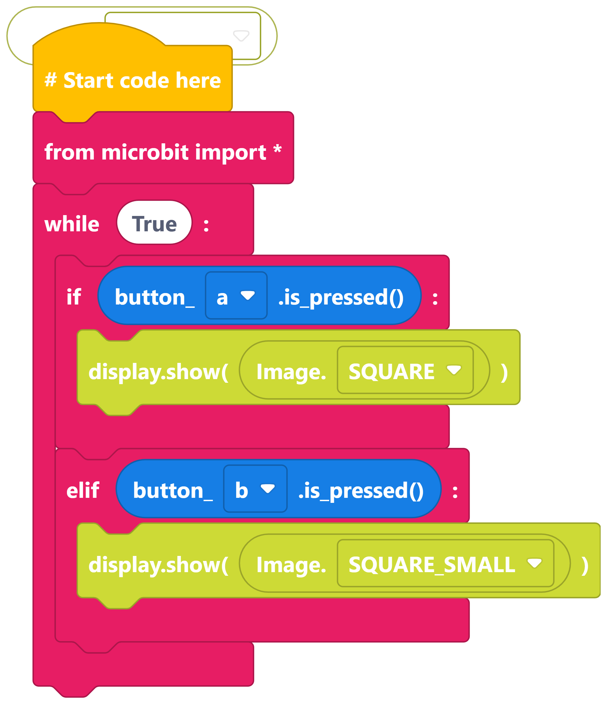
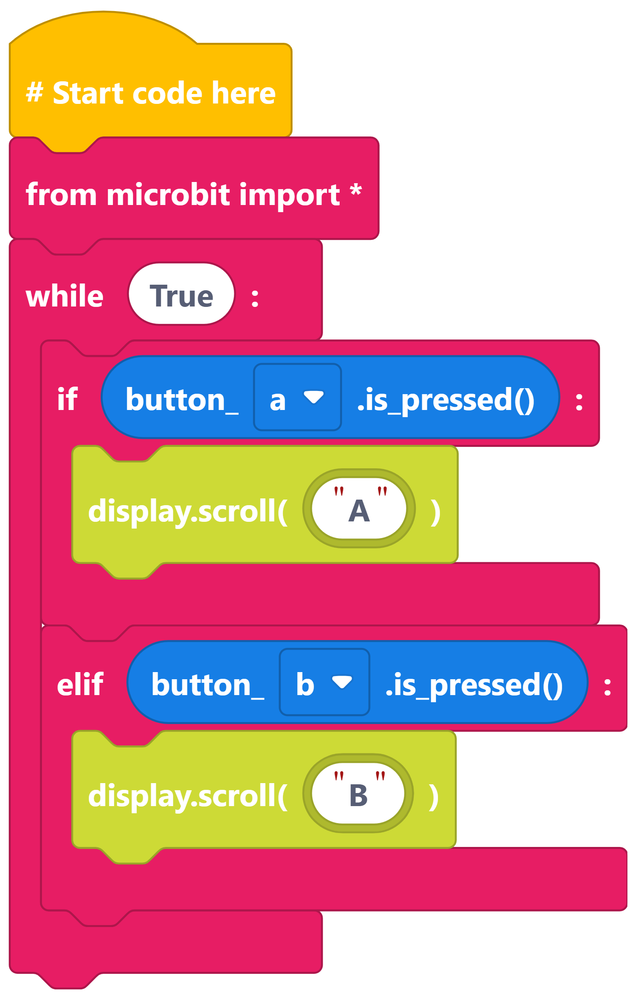

====================================================
Two Choices: if else; if elif
====================================================

| Make the following programs in edublocks.
| Try them on the simulator first and then on your micro:bit.

If else faces
-----------------------------

----

If else animals
-----------------------------

----

If elif squares
-----------------------------

----

If elif AB
-----------------------------

