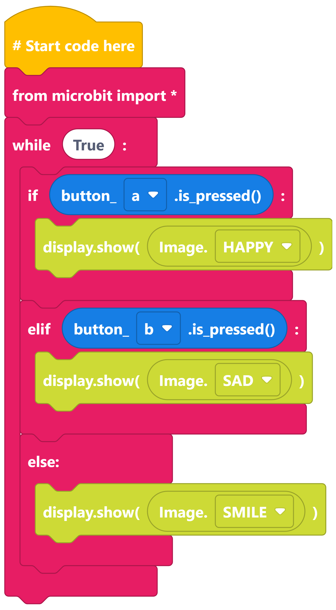
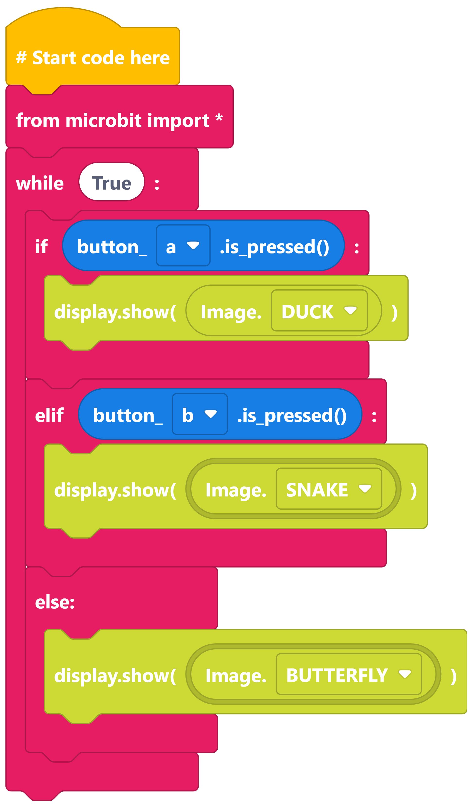
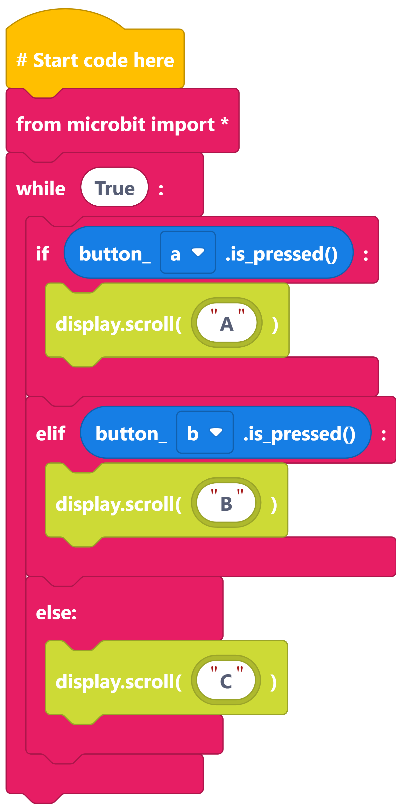

====================================================
Three Choices: if elif else
====================================================

| Make the following programs in edublocks.
| Try them on the simulator first and then on your micro:bit.

If elif else faces
-----------------------------

----

If elif else animals
-----------------------------

---

If elif else ABC
-----------------------------

