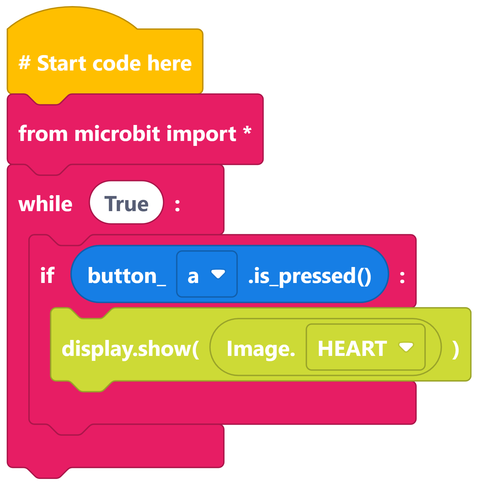
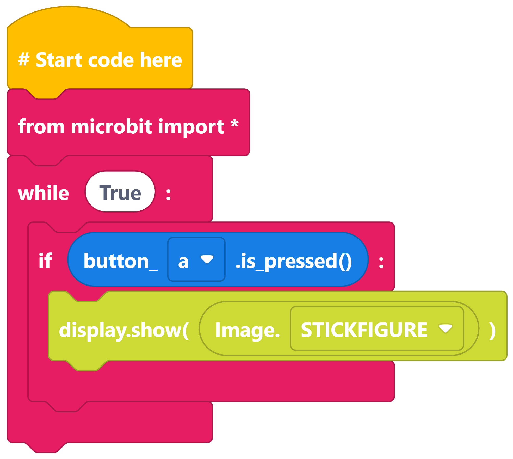
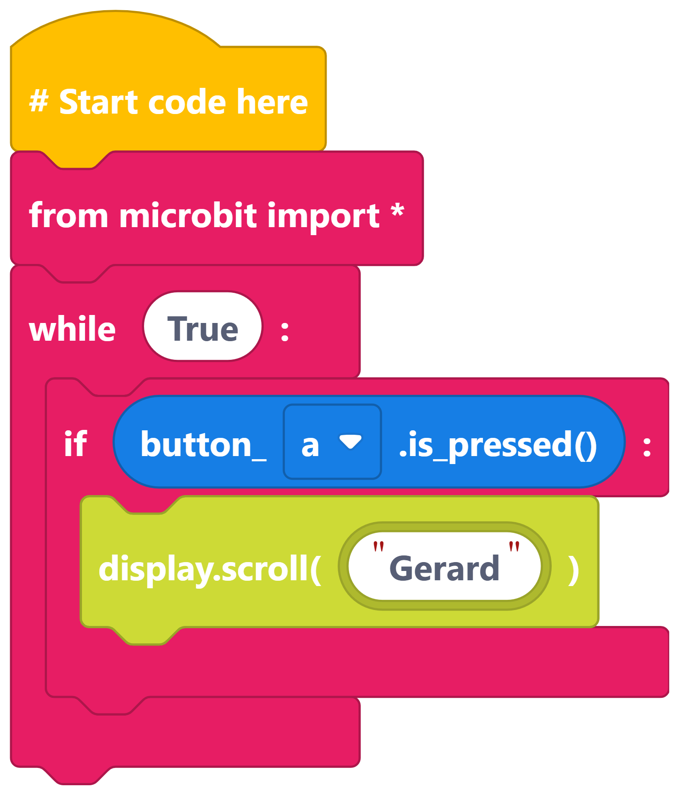
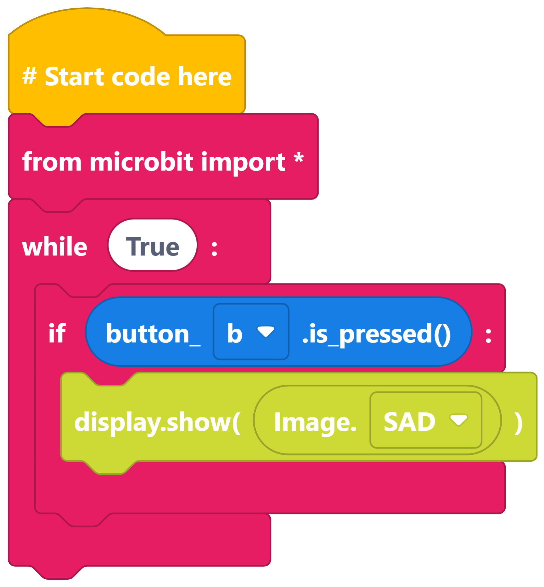
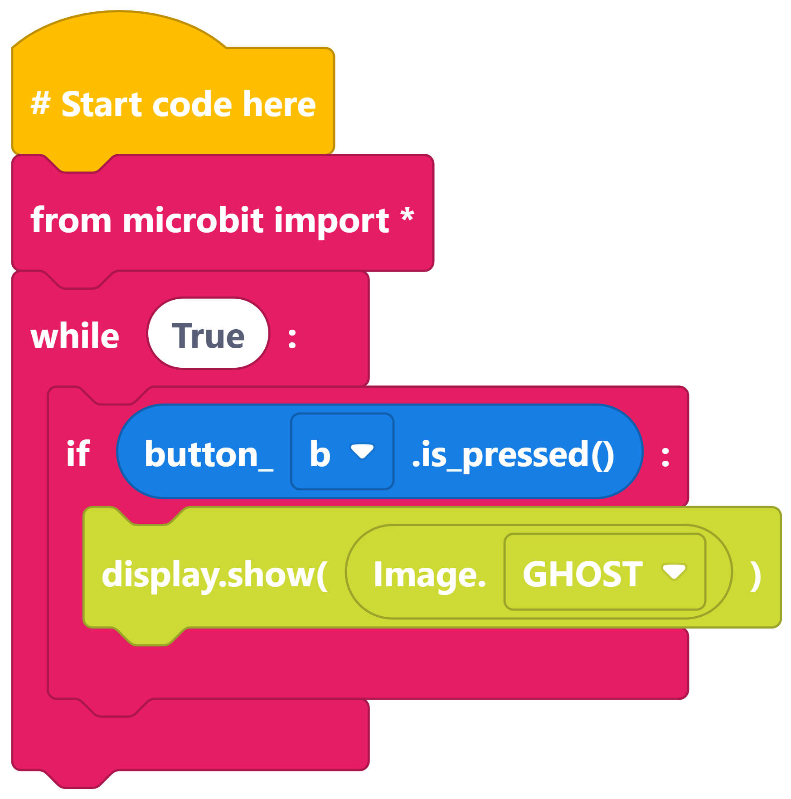
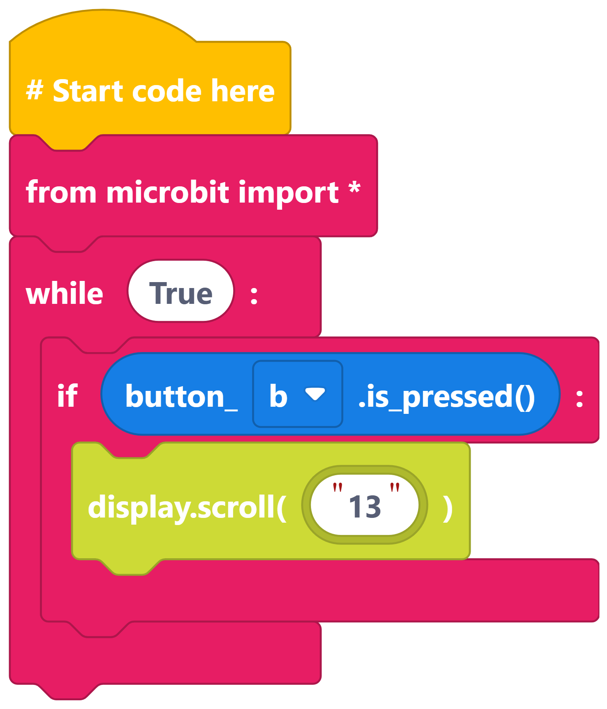

====================================================
Buttons
====================================================

| Make the following programs in edublocks.
| Try them on the simulator first and then on your micro:bit.

Show HEART on Button A
-----------------------------

----

Show STICKFIGURE on Button A
-----------------------------

----

Scroll name on Button A
-----------------------------

----

Show SAD on Button B
-----------------------------

----

Show GHOST on Button B
-----------------------------

----

Scroll age on Button B
-----------------------------

