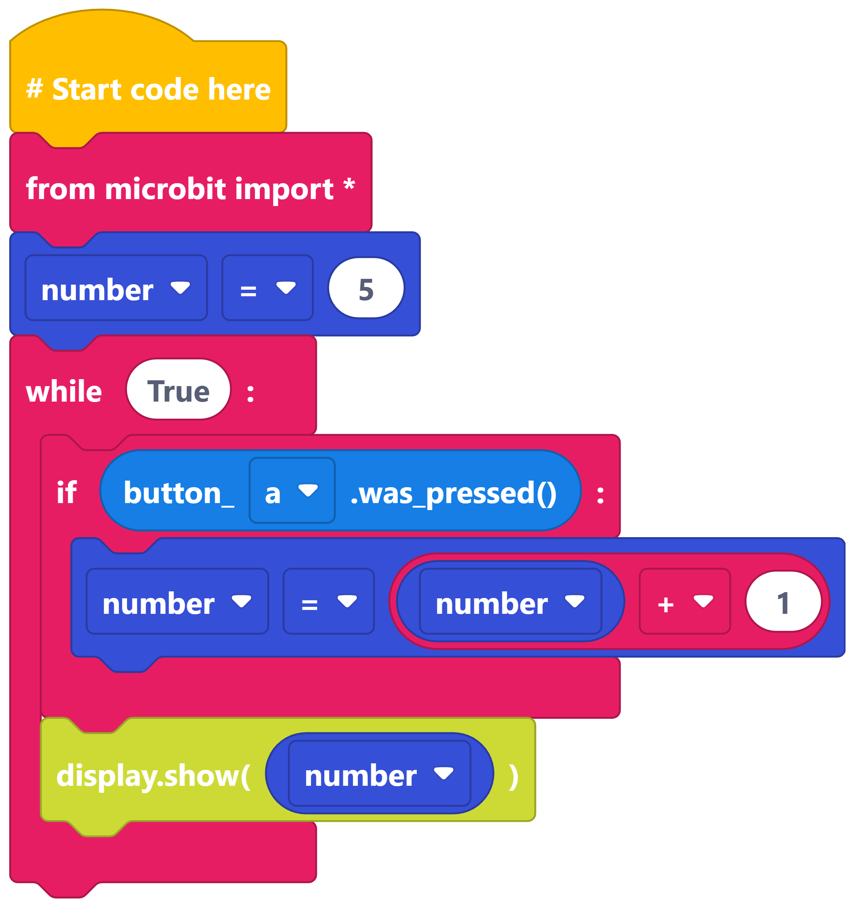
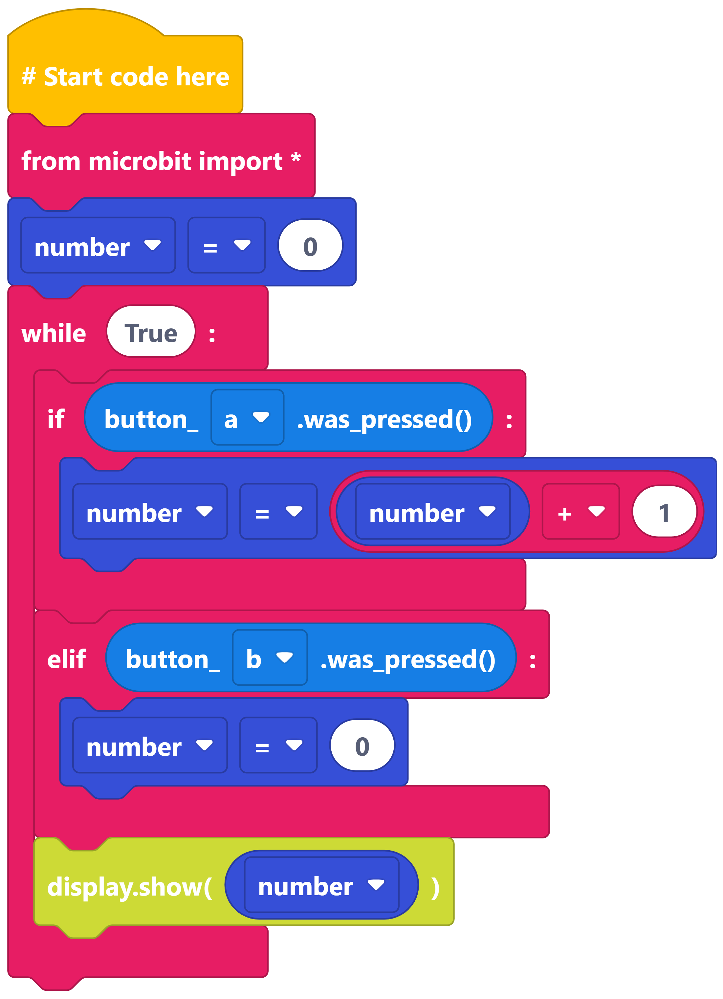
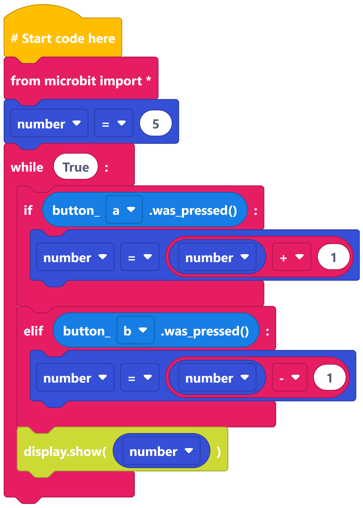

====================================================
Changing Numbers with Buttons
====================================================

| Make the following programs in edublocks.
| Try them on the simulator first and then on your micro:bit.

The buttons can be used to change the value of a variable.

----

Increase a number
-----------------------------

----

Increase and reset a number
-----------------------------

----

Increase and decrease a number
-----------------------------

