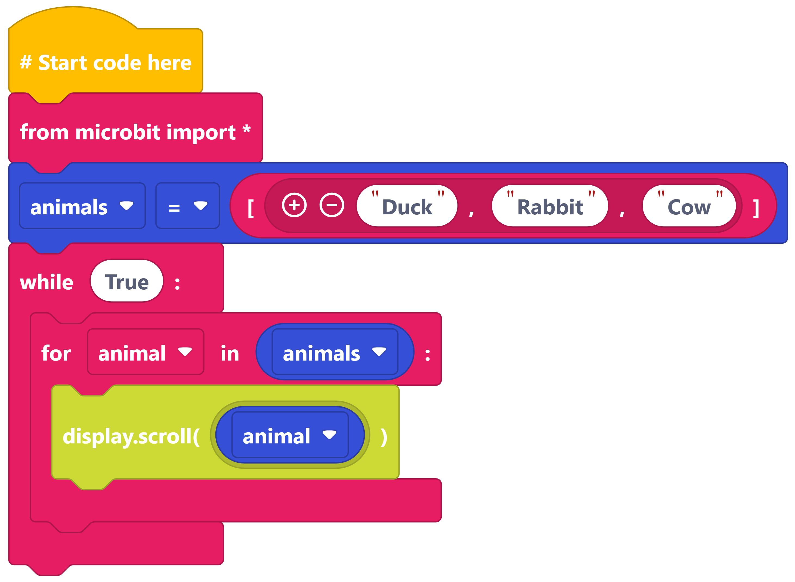
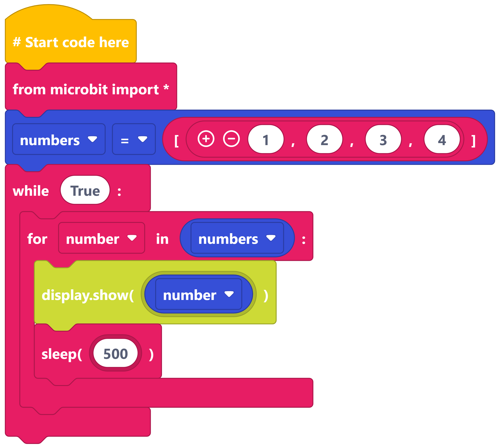
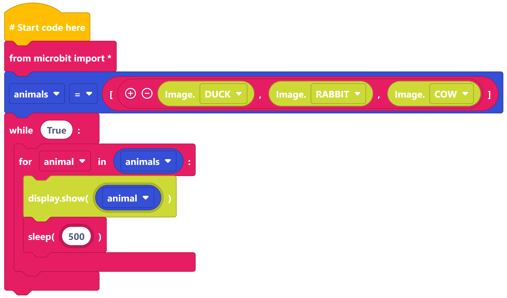

====================================================
For loops with lists
====================================================

| Make the following programs in edublocks.
| Try them on the simulator first and then on your micro:bit.

----

Words in a list
---------------

----

Numbers in a list
-----------------

----

Images in a list
---------------------------

