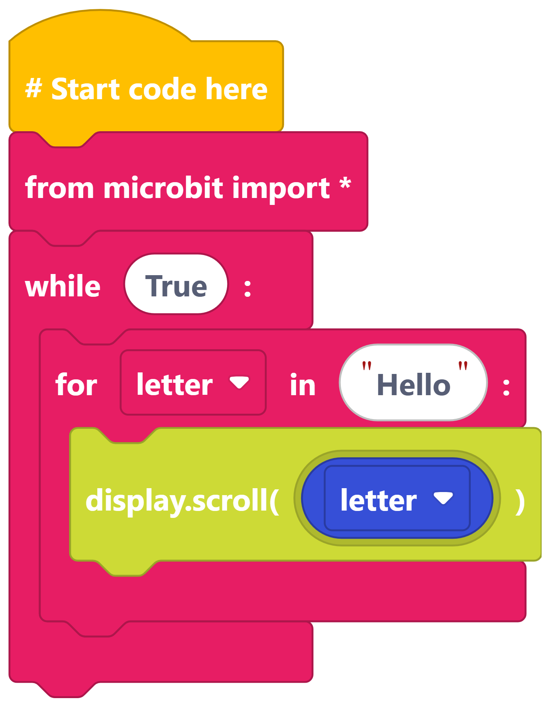
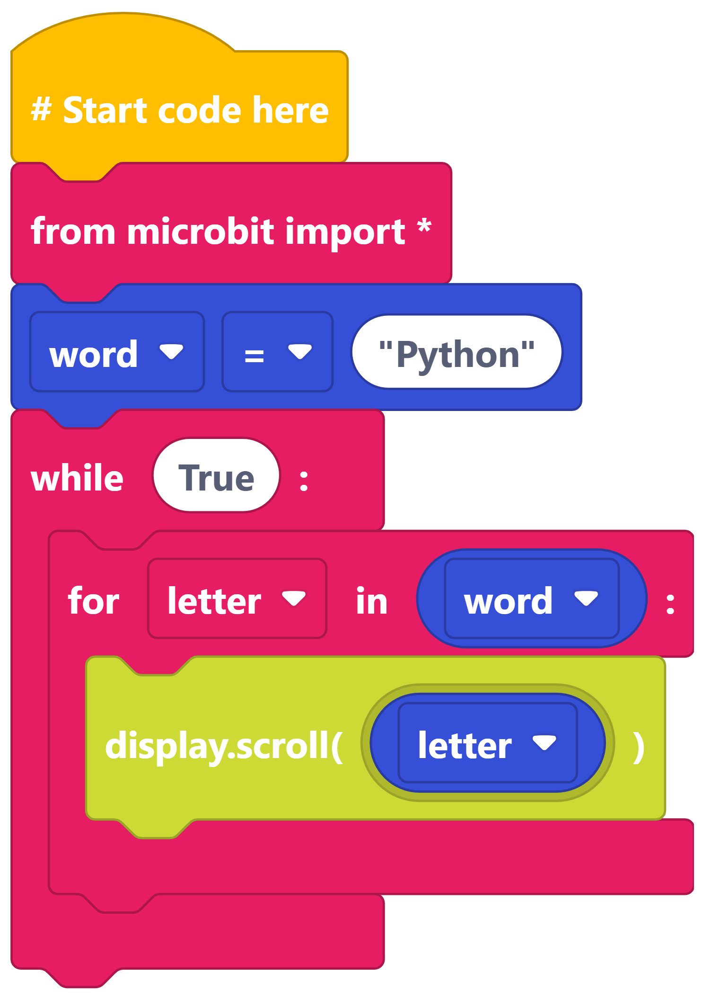
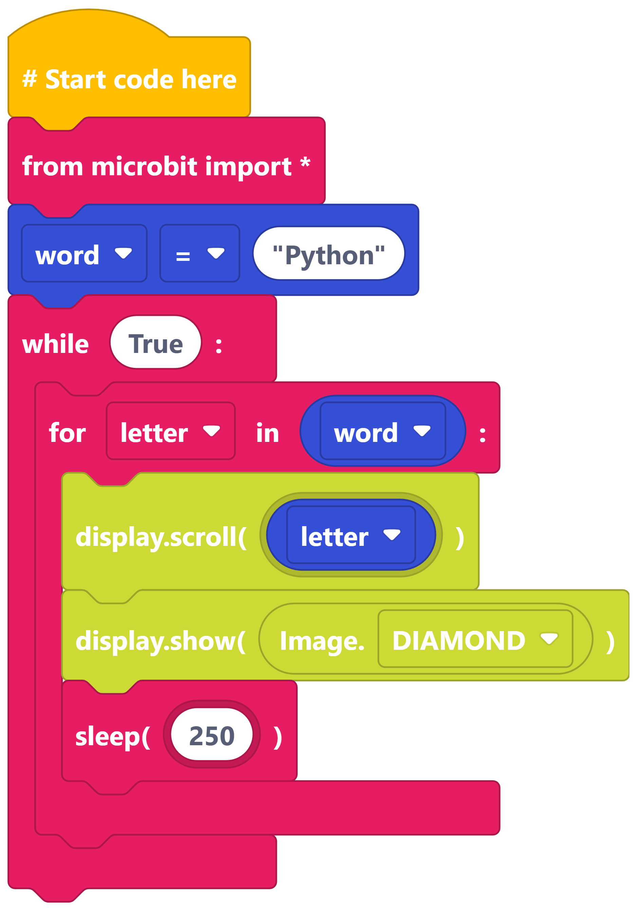

====================================================
For loops with words
====================================================

| Make the following programs in edublocks.
| Try them on the simulator first and then on your micro:bit.

----

Loop through a word
-------------------

----

Loop through a word in a variable
--------------------------------------

----

Adding another action
---------------------

