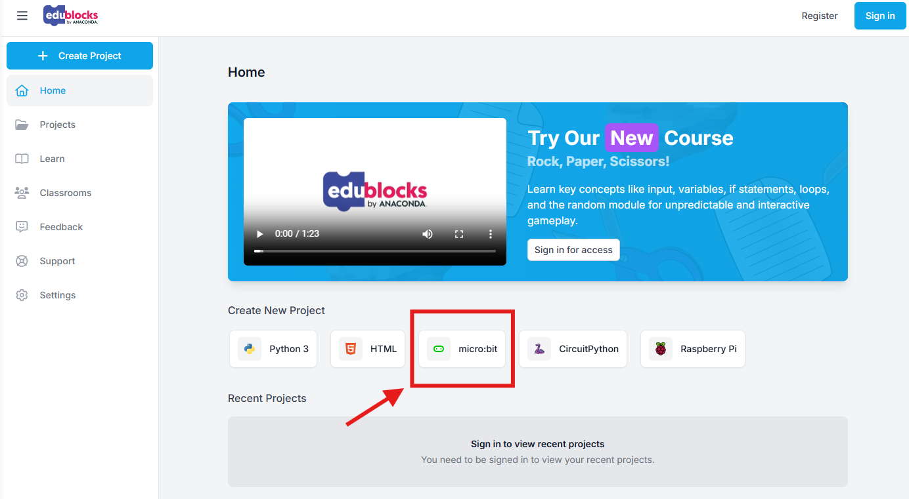
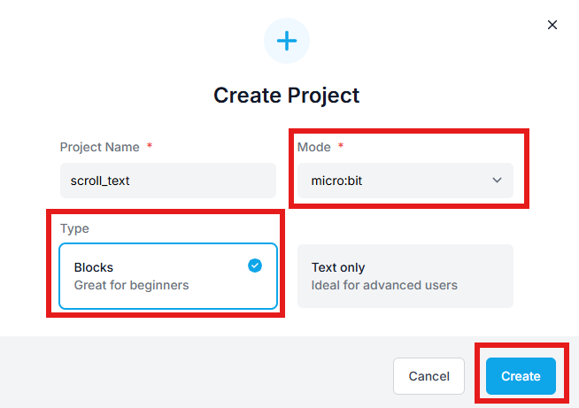
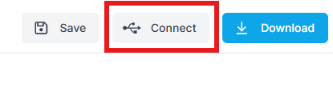

====================================================
EduBlocks Lessons
====================================================

Go to: https://app.edublocks.org/

Click on the "Micro:bit" icon to start programming the micro:bit.

Or click on the "+ Create Project" icon at the top left and create a new project.

----

Connect to Microbit
----------------------

Click on the "Connect" icon at the top right to connect to your micro:bit.

