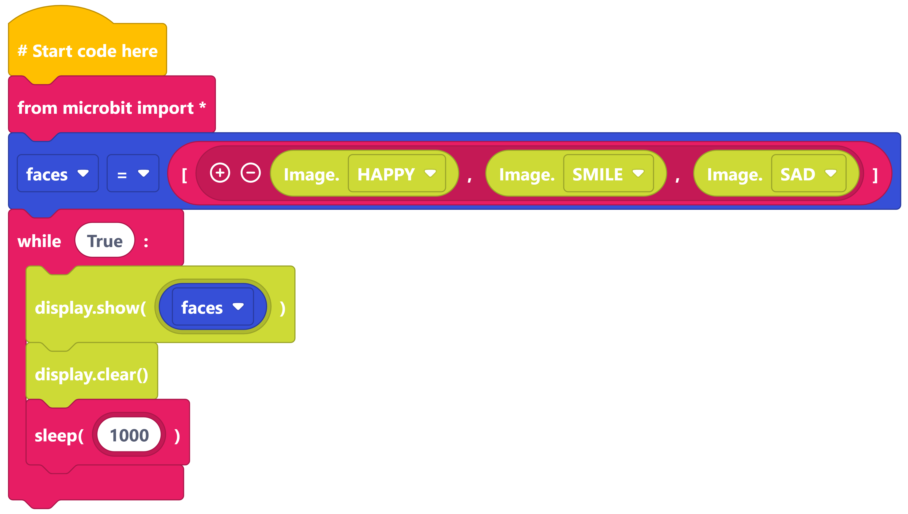
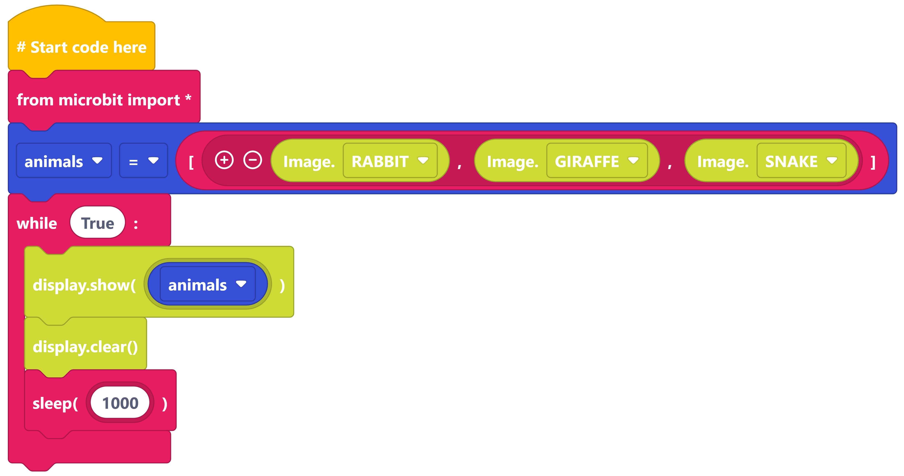
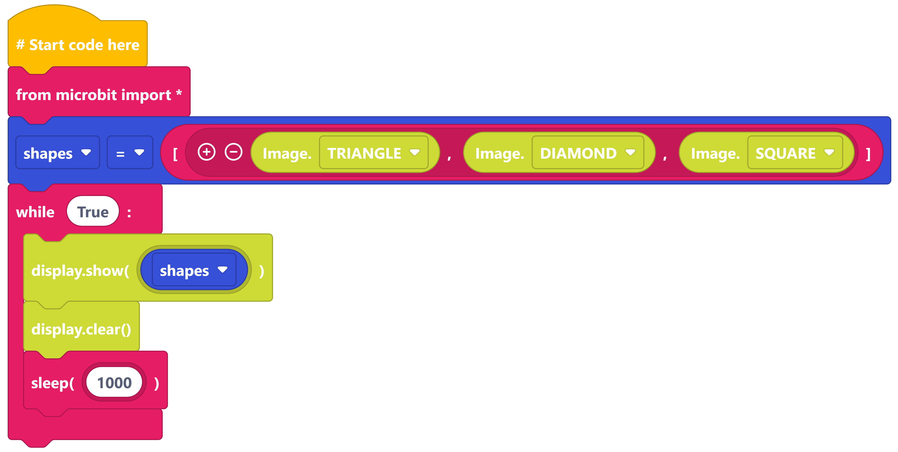

====================================================
Show Image Lists
====================================================

| Make the following programs in edublocks.
| Try them on the simulator first and then on your micro:bit.

Show Faces list
------------------

----

Show Animals list
------------------

----

Show Shapes list
------------------

