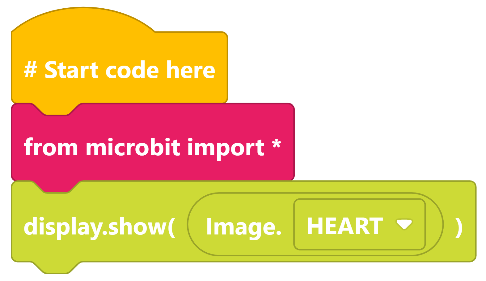
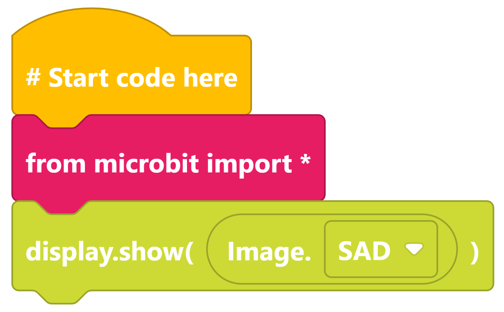
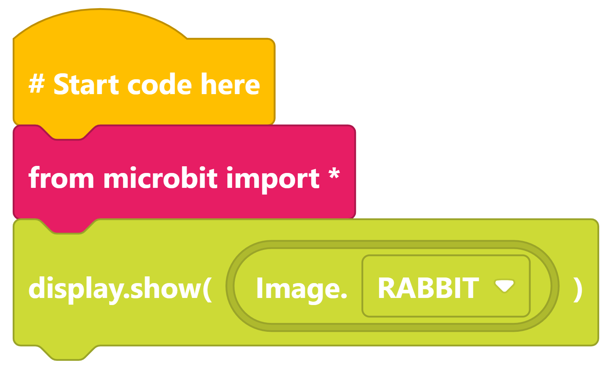
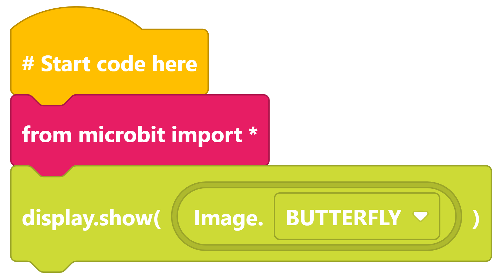
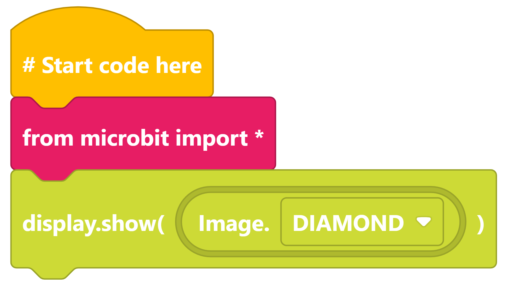
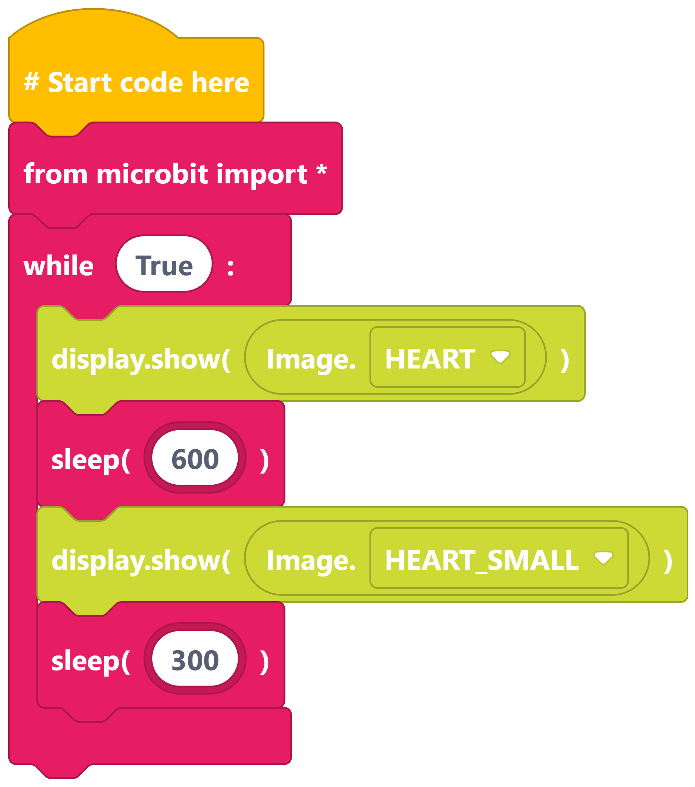
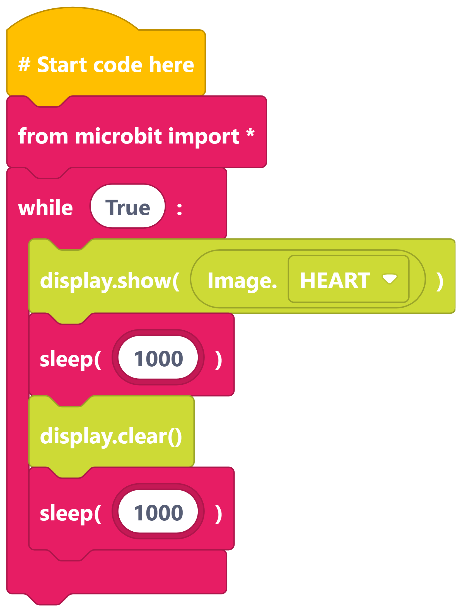

====================================================
Show Images
====================================================

| Make the following programs in edublocks.
| Try them on the simulator first and then on your micro:bit.

Show Faces list
------------------

----

Show HAPPY
------------------

----

Show SAD
------------------

----

Show RABBIT
------------------

----

Show BUTTERFLY
------------------

----

Show TRIANGLE
------------------

----

Show DIAMOND
------------------

----

Show HEART beat
------------------

----

Show HEART pulse
------------------

