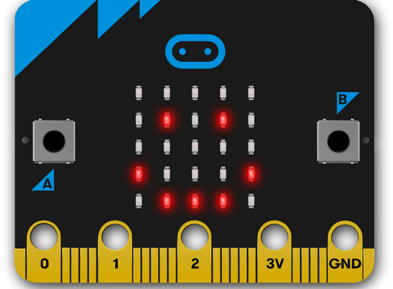

====================================================
Introduction
====================================================

PC-Microbit
----------------------------------------

| These docs will help you code your microbit using micropython.
| Micropython is a version of python for running on small devices like the microbit.

Micropython simulator:
----------------------------------------

| `<https://python.microbit.org/v/3>`_ uses the latest micropython for the latest version of the microbit.

