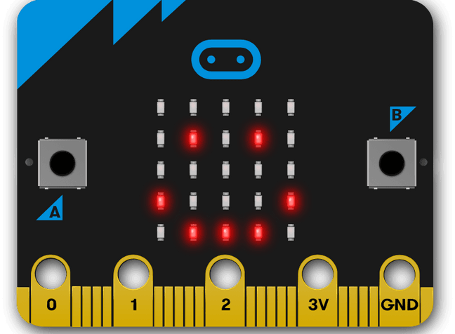

====================================================
Introduction
====================================================

Welcome to the microbit Python course!

You will learn how to make the microbit:

* show words
* show pictures
* use the buttons
* repeat actions

Open the microbit Python editor:

https://python.microbit.org/v/3

